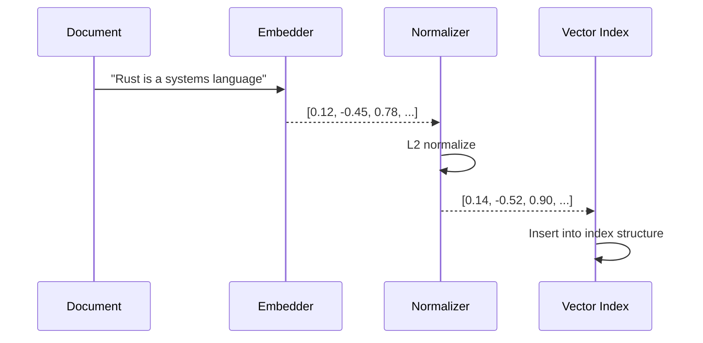
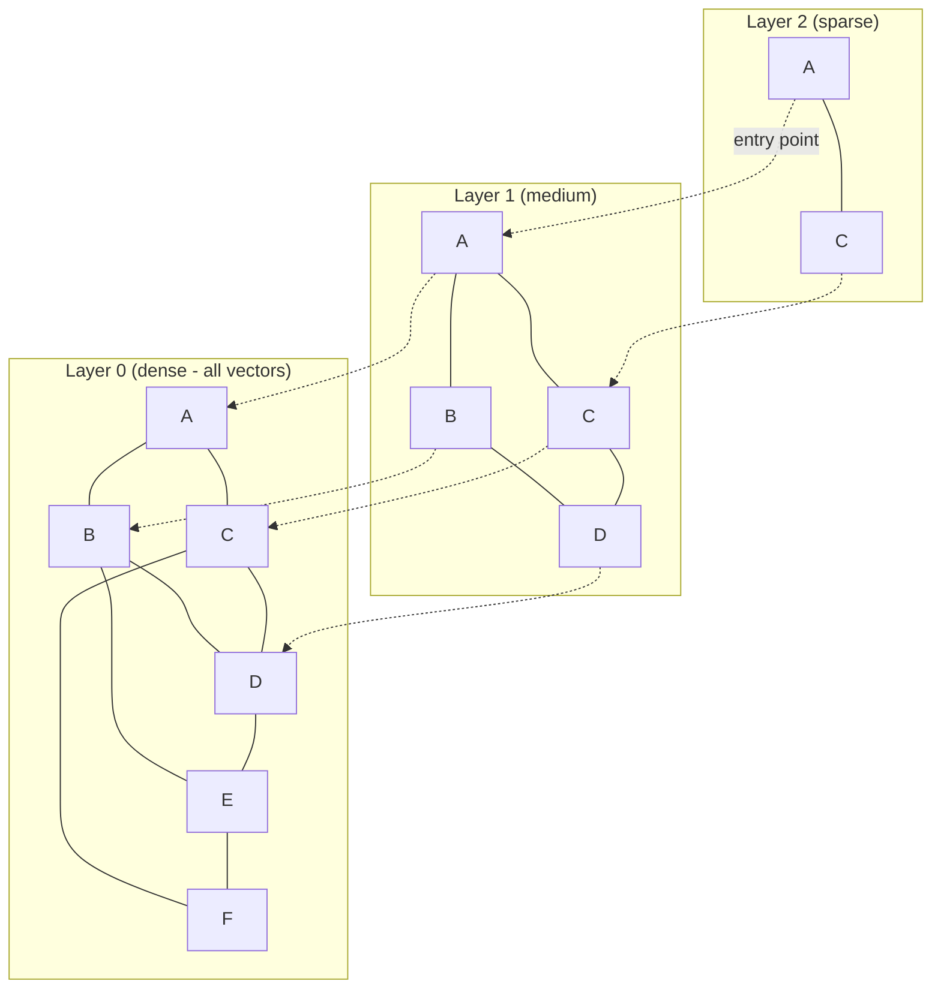
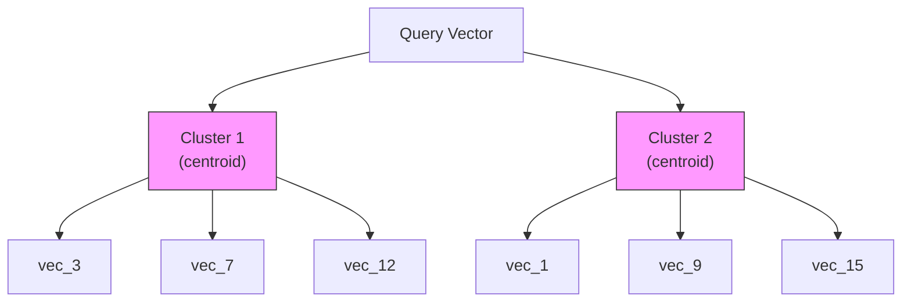

# Vector インデキシング

Vector インデキシングは、類似性ベースの検索を支える仕組みです。ドキュメントのベクトルフィールドがインデキシングされると、Laurus はエンベディングベクトルを専用のインデックス構造に格納し、高速な近似最近傍探索（Approximate Nearest Neighbor, ANN）を可能にします。

## Vector インデキシングの仕組み



### ステップごとの流れ

1. **エンベディング（Embed）**: テキスト（または画像）が、設定されたエンベッダーによってベクトルに変換される
2. **正規化（Normalize）**: ベクトルは **Cosine メトリックの場合のみ** L2 正規化される（大きさ不変なメトリック）。Euclidean / DotProduct / Manhattan のフィールドは距離を保つため元のベクトルのまま保存される
3. **インデキシング（Index）**: ベクトルが設定されたインデックス構造（Flat、HNSW、または IVF）に挿入される
4. **コミット（Commit）**: `commit()` の呼び出し時に、インデックスが永続ストレージにフラッシュされる

## インデックスタイプ

Laurus は 3 種類のベクトルインデックスタイプをサポートしており、それぞれ異なるパフォーマンス特性を持ちます。

### 比較

| 特性 | Flat | HNSW | IVF |
| :--- | :--- | :--- | :--- |
| **精度** | 100%（厳密） | 約 95-99%（近似） | 約 90-98%（近似） |
| **検索速度** | O(n) 線形スキャン | O(log n) グラフ走査 | O(n/k) クラスタスキャン |
| **メモリ使用量** | 低 | 高（グラフエッジ） | 中程度（セントロイド） |
| **インデックス構築時間** | 高速 | 中程度 | 低速（クラスタリング） |
| **最適な用途** | 1 万ベクトル未満 | 1 万 - 1,000 万ベクトル | 100 万ベクトル以上 |

### Flat インデックス

最もシンプルなインデックスです。クエリベクトルを格納されたすべてのベクトルと比較します（総当たり）。

```rust
use laurus::vector::FlatOption;
use laurus::vector::core::distance::DistanceMetric;

let opt = FlatOption {
    dimension: 384,
    distance: DistanceMetric::Cosine,
    ..Default::default()
};
```

- **利点**: 100% の再現率（厳密な結果）、シンプル、低メモリ
- **欠点**: 大規模データセットでは低速（線形スキャン）
- **使用場面**: ベクトル数が約 1 万未満の場合、または厳密な結果が必要な場合

### HNSW インデックス

**Hierarchical Navigable Small World** グラフ。デフォルトで最も一般的に使用されるインデックスタイプです。



HNSW アルゴリズムは、上位の疎なレイヤーから下位の密なレイヤーへと検索し、各レベルで検索空間を絞り込みます。

```rust
use laurus::vector::HnswOption;
use laurus::vector::core::distance::DistanceMetric;

let opt = HnswOption {
    dimension: 384,
    distance: DistanceMetric::Cosine,
    m: 16,                  // max connections per node per layer
    ef_construction: 200,   // search width during index building
    ..Default::default()
};
```

#### HNSW パラメータ

| パラメータ | デフォルト | 説明 | 影響 |
| :--- | :--- | :--- | :--- |
| `m` | 16 | レイヤーごとのノードあたりの最大双方向接続数 | 大きいほど再現率が向上するが、メモリ消費が増加 |
| `ef_construction` | 200 | インデックス構築時の探索幅 | 大きいほど再現率が向上するが、構築が低速に |
| `dimension` | 128 | ベクトルの次元数 | エンベッダーの出力と一致させる必要あり |
| `distance` | Cosine | 距離メトリクス | 下記の距離メトリクスを参照 |

**チューニングのヒント:**

- 再現率を向上させるには `m` を増やす（例: 32 または 64）。ただしメモリ消費が増加する
- インデックス品質を向上させるには `ef_construction` を増やす（例: 400）。ただし構築時間が増加する
- 検索時には、検索リクエストで設定する `ef_search` パラメータが探索幅を制御する

### IVF インデックス

**Inverted File Index**。ベクトルをクラスタに分割し、関連するクラスタのみを検索します。



```rust
use laurus::vector::IvfOption;
use laurus::vector::core::distance::DistanceMetric;

let opt = IvfOption {
    dimension: 384,
    distance: DistanceMetric::Cosine,
    n_clusters: 100,   // number of clusters
    n_probe: 10,       // clusters to search at query time
    ..Default::default()
};
```

#### IVF パラメータ

| パラメータ | デフォルト | 説明 | 影響 |
| :--- | :--- | :--- | :--- |
| `n_clusters` | 100 | ボロノイセル（Voronoi Cell）の数 | クラスタ数が多いほど検索は高速になるが、再現率は低下 |
| `n_probe` | 1 | クエリ時に検索するクラスタ数 | 大きいほど再現率が向上するが、検索が低速に |
| `dimension` | （必須） | ベクトルの次元数 | エンベッダーの出力と一致させる必要あり |
| `distance` | Cosine | 距離メトリクス | 下記の距離メトリクスを参照 |

**チューニングのヒント:**

- `n_clusters` はベクトル数 `n` に対して `sqrt(n)` 程度に設定する
- 再現率と速度のバランスを取るため、`n_probe` を `n_clusters` の 5-20% に設定する
- IVF はトレーニングフェーズが必要なため、初回のインデキシングが遅くなる場合がある

## 距離メトリクス（Distance Metrics）

| メトリクス | 説明 | 値の範囲 | 最適な用途 |
| :--- | :--- | :--- | :--- |
| `Cosine` | 1 - コサイン類似度 | [0, 2] | テキストエンベディング（最も一般的） |
| `Euclidean` | L2 距離 | [0, +inf) | 空間データ |
| `Manhattan` | L1 距離 | [0, +inf) | 特徴ベクトル |
| `DotProduct` | 負の内積 | (-inf, +inf) | 事前正規化済みベクトル |
| `Angular` | 角度距離 | [0, pi] | 方向の類似性 |

```rust
use laurus::vector::core::distance::DistanceMetric;

let metric = DistanceMetric::Cosine;      // Default for text
let metric = DistanceMetric::Euclidean;    // For spatial data
let metric = DistanceMetric::Manhattan;    // L1 distance
let metric = DistanceMetric::DotProduct;   // For pre-normalized vectors
let metric = DistanceMetric::Angular;      // Angular distance
```

> **注意:** ベクトルがインデキシング前に自動的に L2 正規化されるのは **`Cosine` メトリックの場合のみ**です。正規化は大きさ不変なので Cosine では安全（かつ int8 量子化の範囲も締まる）ですが、大きさに依存するメトリックでは距離が変わってしまうため、`Euclidean` / `DotProduct` / `Manhattan` のフィールドは正規化せずに保存されます。距離が小さいほど、より類似していることを示します。
>
> **マイグレーション注記:** この挙動が修正される前に作成した非 Cosine フィールドは、ディスク上に L2 正規化済みのベクトルを持ちます（元の大きさは復元できません）。正しい距離を得るにはインデックスを再構築してください。

## 量子化（Quantization）

ベクトルはディスク上で **8 ビットスカラー量子化された整数** として保存
されます（Issue #481 Stage 1）。以前の 32 ビット浮動小数点形式と比較
して **約 4 倍小さく**、recall 損失は実用上ほぼ無視できる範囲（f32
ground truth に対して Recall@10 ≥ 0.95 — recall テスト
`laurus/tests/vector_recall_test.rs` 参照）です。

| 方式 | Enum バリアント | 説明 | メモリ削減率 |
| :--- | :--- | :--- | :--- |
| **スカラー 8 ビット** *(デフォルト)* | `Scalar8Bit` | per-segment global affine による `u8` 量子化 | 約 4 倍 |
| **プロダクト量子化** *(予約)* | `ProductQuantization { subvector_count }` | Issue #481 Stage 3 — 現状 `NotImplemented` | 約 16-64 倍 |

```rust
use laurus::vector::HnswOption;
use laurus::vector::core::quantization::QuantizationMethod;

// `quantizer` は `Scalar8Bit` がデフォルト。下記は
// `HnswOption { dimension: 384, ..Default::default() }` と等価。
let opt = HnswOption {
    dimension: 384,
    quantizer: QuantizationMethod::Scalar8Bit,
    ..Default::default()
};
```

> **破壊的変更（Issue #481 Stage 1）:** `quantizer` フィールドはもはや
> `Option<QuantizationMethod>` ではなく必須となり、デフォルトは
> `Scalar8Bit` です。f32 のままディスクに保存する形式は廃止されまし
> た。Stage 1 より前に作成した既存 vector index は意図的に読み取り
> 不可能で、ソースデータからの再構築が必要です。

### Scalar8Bit のしくみ

- 各 segment は flush 時に f32 ベクトル群から **global** な
  `(offset, scale)` ペア 1 組をトレーニング
  （`offset = min`, `scale = (max - min) / 255`）。
- 各 `f32` 要素は `u8 = clamp(round((v - offset) / scale), 0, 255)`
  でエンコード。
- 各ベクトル単位のメタデータ（`sum_q: u32`, `norm_q: f32`）を
  事前計算して int8 ペイロードと併置するため、cosine 検索の hot loop
  は int8 SIMD multiply-accumulate 1 回 + scalar 補正 3 回に縮約され、
  検索時の per-element dequantize は不要。
- segment ファイルは `LVS1` magic + 16 byte header で始まり、reader
  はロード時にフォーマットを判定。

### Two-stage rerank（Issue #481 Stage 2）

Stage 1 ではベクトルを int8 のみで保持します。グラフ検索は完全に int8
距離に対して行われ、高速ですがわずかな量子化誤差が入ります。Stage 2
ではフィールド単位で **任意の** f32 sidecar を追加し、上位候補を元の
完全精度ベクトルで再スコアできるようにします:

1. HNSW int8 グラフ検索が量子化コサイン距離で最大 `ef_search` 件の
   候補を返す。
2. 上位 `top_k * rerank_factor` 件を [LRS1
   sidecar](#lrs1-rerank-sidecar)（`*.hnsw.f32`）から読み込んだ f32
   ベクトルで再スコアする。
3. 新しいランキングを `top_k` に切り詰めて返す。

Stage 2 はフィールド単位で
[`HnswOption.rerank_storage`](../../laurus-cli/schema_format.md#rerank-storage)
で opt-in します:

```rust
use laurus::vector::HnswOption;
use laurus::vector::core::rerank::RerankStorageKind;

let opt = HnswOption {
    rerank_storage: Some(RerankStorageKind::F32),
    ..HnswOption::default()
};
```

クエリ側は `VectorIndexQuery::rerank_factor`（low-level）、
`SearchRequestBuilder::vector_rerank_factor`（engine）、
gRPC / JSON の `VectorParams.rerank_factor` のいずれかで rerank
factor を渡します。

`rerank_storage` が無効なフィールドでは `rerank_factor` を指定しても
silent に Stage 1 int8 ランキングへフォールバックします — Stage 1
セグメントから f32 情報を復元することはできません。

#### LRS1 rerank sidecar

sidecar は `rerank_storage` が有効なときに LVS1 セグメントの隣に
書かれる別ファイルです:

```text
offset  size  field
------  ----  -------------------------------------------
     0     4  magic         ASCII "LRS1"
     4     2  version       u16 LE  (current = 1)
     6     2  storage_kind  u16 LE  (1 = F32; 0 reserved; 2.. future)
     8     8  reserved      zero-padded
    16     4  dim           u32 LE
    20     4  vector_count  u32 LE
    24     -  payload       vector_count * dim * bytes_per_element
   end     8  footer        magic "LRC1" u32 LE + CRC-32 u32 LE
                             （header + payload が対象）
```

ベクトルは LVS1 セグメントと同じ `(doc_id, field_name)` 順で書かれる
ので、(sidecar position) → (LVS1 position) のマッピングは恒等関数に
なります。HNSW reader は storage の loading mode が Eager のとき初期化
時に sidecar を `RerankStoragePool` にロードします。Lazy mode では
memory savings の前提を尊重するため sidecar 読み込みをスキップします
（Lazy mode で開いた Stage 2 セグメントは silent に Stage 1 へ
degrade します）。

sidecar はスキーマの HNSW オプションの `rerank_storage` でフィールド
ごとに有効化され、その設定はすべての書き込み経路で尊重されます。直接
の commit、アクティブな書き込みセグメント、セグメントの merge いずれも
生成したセグメントに対して sidecar を再出力します。マージ後セグメント
の sidecar は **ソースセグメントの原 f32 サイドカー** から再構築されます
（int8 復元値ではなく）。これによりマージはマージごとに量子化誤差を 1 段
ずつ蓄積させず、rerank ベクトルを無損失に保ちます。

新しい sidecar は末尾に header + payload を対象とする 8 バイトの
CRC-32 footer を持ち、sidecar を読むすべての経路（searcher のロードと
writer の再ロード）で検証されます。これにより、ディスク上の静かな破損
が rerank スコアを歪める代わりに拒否されます。header からコンテンツ長
が一意に決まるため、footer は payload の後ろに残っているバイト数で
検出されます — footer 導入前に書かれた sidecar は末尾バイトがゼロ
なのでそのままロードでき、検証はスキップされます。

#### recall と速度の trade-off

`rerank_factor` は per-query rerank コスト（`top_k * rerank_factor`
回の exact distance 計算 — dim 128 で数 µs）と引き換えに Recall@10 の
向上を得る lever です。実際の効果はコーパスとグラフ検索 budget
（`ef_search`）に依存します:

- 実際の clustered な embedding（text-embedding-3、BERT など）は
  低い `ef_search` で `Recall@10 ≥ 0.99` に到達し、rerank は微小な
  latency 増で順位を磨きます。
- 合成 random unit-norm（HNSW 復元の最悪ケース）では int8 グラフが
  真の top-10 候補を十分に visit するために高い `ef_search` が必要で、
  rerank は visit 済み候補を並び替えられても visit していないものは
  取り戻せません。

recall acceptance は rerank kernel と HNSW フルパイプラインを独立に
落とせるよう、CI gate を 2 段に分けています:

- `stage2_brute_force_rerank_recall_at_10_meets_kernel_gate` は
  `Recall@10 ≥ 0.99` を assert します。HNSW グラフを完全にバイパス
  し（brute-force int8 で corpus 全体を採点 → `top_k * rerank_factor`
  に絞る → f32 で再スコア）miss すれば rerank kernel の regression
  と切り分けられます。
- `hnsw_quantized_recall_at_10_with_rerank_meets_stage2_recall_gate`
  は `Recall@10 ≥ 0.98` を assert します。HNSW build の
  non-determinism（f32 HNSW baseline でも同様に出るノイズ）を
  含むため、合成 adversarial 分布での run-to-run 観測幅に合わせて
  しきい値を緩めています。実 embedding の clustered 分布や
  強めの HNSW config（m=32, ef_construction=500）はこのパス
  でも ≥ 0.99 に到達します（下の diagnostic sweep を参照）。

companion の `stage2_recall_sweep_diagnostic`（`LAURUS_STAGE2_SWEEP=1`
で opt-in）は `(ef_search, rerank_factor)` を 3 種の corpus / query
分布 × 2 種の HNSW config で sweep するので、production deployment
は実際の embedding 分布で budget を calibrate できます。

#### 実データ検証（Issue #498）

3 つめの opt-in CI gate として、 Stage 2 を実 ANN benchmark dataset
（TEXMEX の SIFT1M）で検証します。 synthetic data の gate だけが
signal にならないようにするためのものです。

- `hnsw_quantized_recall_at_10_with_rerank_on_sift_meets_stage2_real_data_recall_gate`
  は SIFT1M の 50 000 ベクトルサブサンプル上で
  `(m=16, ef_construction=200, ef_search=200, rerank_factor=5)` の
  Recall@10 ≥ 0.99 を assert します。
- companion bench `bench_hnsw_graph_search_rerank_real_data`
  （`laurus/benches/vector_search_bench.rs`）は同じ fixture で
  end-to-end Stage 2 latency を測定します。 同梱の
  `laurus/examples/sift_rerank_probe.rs` は
  `(ef_search × rerank_factor × HNSW config)` を sweep して
  `(Recall, latency)` を per-cell で報告するので、運用側は自分の
  データに合った operating point を選べます。

両者は `LAURUS_REAL_BENCHMARK=1` と `.cache/sift/sift/` 配下の
SIFT1M `.fvecs` ファイルの存在で gate されます。 デフォルトの CI
runs は変化しません。 ローカルで有効化するには:

```sh
./scripts/fetch-sift.sh --large   # ~478MB
LAURUS_REAL_BENCHMARK=1 cargo test --release \
    --test vector_recall_test \
    hnsw_quantized_recall_at_10_with_rerank_on_sift_meets_stage2_real_data_recall_gate \
    -- --nocapture
LAURUS_REAL_BENCHMARK=1 cargo bench --bench vector_search_bench \
    -- "HNSW Graph Search Rerank Real"
```

Issue #481 の原文は "≥ 3× speedup vs the pre-Stage-1 f32 baseline"
を要求していましたが、 SIFT1M-50k での cross-branch Criterion 計測
（30 サンプル中央値、同じ `(m, ef_construction, ef_search)`）では
pre-Stage-1 f32 HNSW path が 625 µs/query、 Stage 2 int8 + rerank
path が 323 µs/query となり、 speedup は **1.94×** でした。 この
実測結果を受けて Issue #498 では real-data gate を **≥ 1.5×** に
下げています（recall 側は元の 0.99 を維持）。 3× との gap は、
rerank が int8 graph traversal で visit 済みの候補を re-rank する
だけで、 `ef_search` を下げると candidate set 自体が狭くなり rerank
で回収できないことに起因します。 follow-up としては graph search
budget を `ef_search` から独立に広げる（Lucene 99 pattern）案が
あります。

### Product Quantization + rerank（Issue #481 Stage 3）

Stage 3 は HNSW index 向けに opt-in の **Product Quantization** path を
追加します。 各 segment は per-field の codebook（`M` 個の sub-vector
× `K = 256` centroid）を k-means++ + Lloyd 反復で学習し、 各ベクトル
を `M` バイトで保存します（sub-vector あたり 1 centroid index）。
検索ホットループでは int8 SIMD kernel を **asymmetric distance
computation**（ADC）に置き換えます: query 1 回ごとに query
sub-vector と codebook entry の squared distance を `M × K`
look-up table に展開し、候補ごとに `Σ_m lut[m][codes[m]]` で
スコアリング（1 候補あたり `M` lookups + `M − 1` add）。

PQ は per-field `HnswOption.quantizer` で有効化:

```rust
use laurus::vector::HnswOption;
use laurus::vector::core::quantization::QuantizationMethod;
use laurus::vector::core::rerank::RerankStorageKind;

let opt = HnswOption {
    dimension: 128,
    quantizer: QuantizationMethod::ProductQuantization { subvector_count: 32 },
    // SIFT1M の PQ-only Recall@10 は 0.78-0.92 で頭打ちのため、
    // production では LRS1 rerank sidecar との組み合わせを推奨
    // （Stage 2 と同じ仕組み、 candidate 生成側のみ int8 から PQ
    // に置き換わる）。
    rerank_storage: Some(RerankStorageKind::F32),
    ..Default::default()
};
```

`subvector_count` は `dimension` を割り切る値を選択。 `dim = 128`
での候補: `M ∈ {8, 16, 32}`（sub_dim 16 / 8 / 4）。 `M` を大きく
すると compression は下がるが recall は上がります。 Issue #481
Stage 3 は 8 bit（K = 256）のみを ship、 on-disk format は
将来の 4 bit（K = 16）variant 用に枠を予約しています。

#### on-disk format

PQ segment は Scalar8Bit と同じ `LVS1` header を使用（`quant_kind =
2`）し、 codebook は per-segment metadata block 内に格納:

```text
[ Fixed header           16 bytes ]
[ PQ params               8 bytes ]    m / k / sub_dim / padding (u16 × 4)
[ Codebook                m × k × sub_dim × 4 bytes ]
[ Per-vector codes        num_vectors × m bytes ]
```

`dim = 128, M = 32, K = 256` の場合 codebook = `32 × 256 × 4 × 4 =
131 072 bytes`（128 KB）+ ベクトル 1 件あたり 32 byte。

#### Recall と speed gate（Issue #481 Stage 3）

- **Kernel レベルテスト** — synthetic 5 000 ベクトル / dim 128 / 100
  query、 `(m=16, ef_construction=200, ef_search=200,
  rerank_factor=10, M=32)`:
  `hnsw_pq_rerank_recall_at_10_meets_stage3_recall_gate` が
  Recall@10 ≥ 0.95 を assert。 実測 0.9660。
- **実データテスト** — SIFT1M-50k subsample（opt-in:
  `LAURUS_REAL_BENCHMARK=1`、同設定）:
  `hnsw_pq_rerank_recall_at_10_on_sift_meets_stage3_real_data_recall_gate`
  が Recall@10 ≥ 0.95 を assert。 実測 0.9965。
- **実データ speed bench** —
  `bench_hnsw_graph_search_pq_rerank_real_data`（opt-in、Criterion）。
  同 SIFT1M-50k 設定での cross-branch 計測: pre-Stage-1 f32 HNSW =
  625.21 µs/query（PR #500 計測値）、 Stage 3 PQ + rerank =
  **299.54 µs/query** = **2.09× speedup**。

Issue #481 の原文は Recall ≥ 0.95 で ≥ 5× speedup を要求していました
が、 本 PR の実測で SIFT1M ではその target が到達不可能と判明。
Stage 2（#500）と Stage 3 は両方とも 1.9-2.1× の band で着地しており、
candidate set を recall が回収可能な幅まで広げると rerank がホット
パスを支配することが原因です。 これを受けて gate は ≥ 1.5× に
下げられています。 follow-up としては Lucene 99 pattern（graph
search の独立 budget）や 4 bit PQ variant でこの gap を埋める方向が
考えられます。

## セグメントファイル

各ベクトルインデックスタイプは、データを単一のセグメントファイルに格納します。

| インデックスタイプ | ファイル拡張子 | 内容 |
| :--- | :--- | :--- |
| HNSW | `.hnsw` | グラフ構造、ベクトル、メタデータ |
| Flat | `.flat` | 生ベクトルとメタデータ |
| IVF | `.ivf` | クラスタセントロイド、割り当て済みベクトル、メタデータ |

## コード例

```rust
use std::sync::Arc;
use laurus::{Document, Engine, Schema};
use laurus::lexical::TextOption;
use laurus::vector::HnswOption;
use laurus::vector::core::distance::DistanceMetric;
use laurus::storage::memory::MemoryStorage;

#[tokio::main]
async fn main() -> laurus::Result<()> {
    let storage = Arc::new(MemoryStorage::new(Default::default()));
    let schema = Schema::builder()
        .add_text_field("title", TextOption::default())
        .add_hnsw_field("embedding", HnswOption {
            dimension: 384,
            distance: DistanceMetric::Cosine,
            m: 16,
            ef_construction: 200,
            ..Default::default()
        })
        .build();

    // With an embedder, text in vector fields is automatically embedded
    let engine = Engine::builder(storage, schema)
        .embedder(my_embedder)
        .build()
        .await?;

    // Add text to the vector field — it will be embedded automatically
    engine.add_document("doc-1", Document::builder()
        .add_text("title", "Rust Programming")
        .add_text("embedding", "Rust is a systems programming language.")
        .build()
    ).await?;

    engine.commit().await?;

    Ok(())
}
```

## 次のステップ

- ベクトルインデックスを検索する: [Vector 検索](../search/vector_search.md)
- Lexical 検索と組み合わせる: [ハイブリッド検索](../search/hybrid_search.md)
