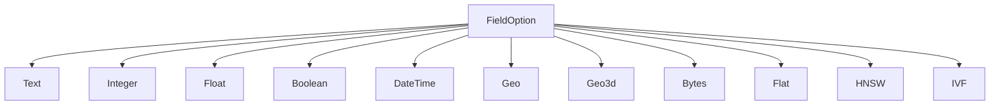
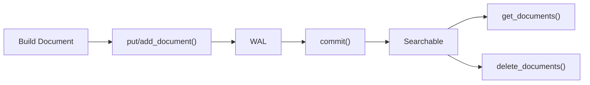

# スキーマとフィールド

`Schema` はドキュメントの構造を定義します。どのフィールドが存在し、各フィールドがどのようにインデクシングされるかを指定します。Schema は Engine にとって唯一の情報源です。

> CLI で使用される TOML ファイル形式については、[スキーマフォーマットリファレンス](../laurus-cli/schema_format.md)を参照してください。

## Schema

`Schema` は名前付きフィールドのコレクションです。各フィールドは**Lexical フィールド**（キーワード検索用）または **Vector フィールド**（類似度検索用）のいずれかです。

```rust
use laurus::Schema;
use laurus::lexical::TextOption;
use laurus::lexical::core::field::IntegerOption;
use laurus::vector::HnswOption;

let schema = Schema::builder()
    .add_text_field("title", TextOption::default())
    .add_text_field("body", TextOption::default())
    .add_integer_field("year", IntegerOption::default())
    .add_hnsw_field("embedding", HnswOption::default())
    .add_default_field("body")
    .build();
```

### デフォルトフィールド

`add_default_field()` は、クエリがフィールド名を明示的に指定しない場合に検索対象となるフィールドを指定します。これは [Query DSL](../concepts/query_dsl.md) パーサーで使用されます。

## フィールドタイプ



### Lexical フィールド

Lexical フィールドは転置インデックス（Inverted Index）を使用してインデクシングされ、キーワードベースのクエリをサポートします。

| タイプ | Rust 型 | SchemaBuilder メソッド | 説明 |
| :--- | :--- | :--- | :--- |
| **Text** | `TextOption` | `add_text_field()` | 全文検索可能。Analyzer によりトークン化される |
| **Integer** | `IntegerOption` | `add_integer_field()` | 64 ビット符号付き整数。範囲クエリをサポート |
| **Float** | `FloatOption` | `add_float_field()` | 64 ビット浮動小数点数。範囲クエリをサポート |
| **Boolean** | `BooleanOption` | `add_boolean_field()` | `true` / `false` |
| **DateTime** | `DateTimeOption` | `add_datetime_field()` | UTC タイムスタンプ。範囲クエリをサポート |
| **Geo** | `GeoOption` | `add_geo_field()` | 緯度/経度のペア。半径検索とバウンディングボックスクエリをサポート |
| **Geo3d** | `Geo3dOption` | `add_geo3d_field()` | 3D ECEF 直交座標ポイント（`x`, `y`, `z`、メートル）。3D 距離検索・バウンディングボックス・k-NN クエリをサポート。詳細は [3D 地理検索](geo3d.md) を参照 |
| **Bytes** | `BytesOption` | `add_bytes_field()` | バイナリデータ |

#### Text フィールドオプション

`TextOption` はテキストのインデクシング方法を制御します。

```rust
use laurus::lexical::TextOption;

// Default: indexed + stored + term vectors (all true)
let opt = TextOption::default();

// Customize
let opt = TextOption::default()
    .indexed(true)
    .stored(true)
    .term_vectors(true);
```

| オプション | デフォルト | 説明 |
| :--- | :--- | :--- |
| `indexed` | `true` | フィールドが検索可能かどうか |
| `stored` | `true` | 元の値が取得用に保存されるかどうか |
| `term_vectors` | `true` | ターム位置が保存されるかどうか（フレーズクエリやハイライトに必要） |

### Vector フィールド

Vector フィールドは近似最近傍（ANN: Approximate Nearest Neighbor）検索のためのベクトルインデックスを使用してインデクシングされます。

| タイプ | Rust 型 | SchemaBuilder メソッド | 説明 |
| :--- | :--- | :--- | :--- |
| **Flat** | `FlatOption` | `add_flat_field()` | ブルートフォース線形スキャン。正確な結果 |
| **HNSW** | `HnswOption` | `add_hnsw_field()` | Hierarchical Navigable Small World グラフ。高速な近似検索 |
| **IVF** | `IvfOption` | `add_ivf_field()` | Inverted File Index。クラスタベースの近似検索 |

#### HNSW フィールドオプション（最も一般的）

```rust
use laurus::vector::HnswOption;
use laurus::vector::core::distance::DistanceMetric;
use laurus::vector::core::quantization::QuantizationMethod;

let opt = HnswOption {
    dimension: 384,                                  // vector dimensions
    distance: DistanceMetric::Cosine,                // distance metric
    m: 16,                                           // max connections per layer
    ef_construction: 200,                            // construction search width
    default_ef_search: Some(100),                    // schema-level ef_search default (issue #644)
    base_weight: 1.0,                                // default scoring weight
    quantizer: QuantizationMethod::Scalar8Bit,       // 必須（デフォルト Scalar8Bit）
    embedder: None,                                  // 任意の embedder 名
};
```

#### `default_ef_search`: 検索時の recall 調整パラメータ

`ef_search` はクエリ時の動的候補リストのサイズを制御するパラメータです（`ef_construction` がインデックス**ビルド時**にだけ影響するのとは別物です）。値を大きくするほどグラフ近傍の探索範囲が広がり、レイテンシと引き換えに recall が上がります。

- **スキーマレベルのデフォルト**: `HnswOption.default_ef_search = Some(ef)` でフィールドごとのデフォルトを引き上げられます。`None` の場合、サーチャは内部 fallback (`50`) を使用します。
- **クエリごとのオーバーライド**: 検索リクエスト側で [`SearchRequestBuilder::vector_ef_search`](../laurus.md) を指定すると、スキーマデフォルトより優先されます。
- **自動引き上げ**: いずれの経路で `ef_search` を指定した場合でも、サーチャは少なくとも `top_k`（`rerank_factor` 併用時は `top_k * rerank_factor`）まで持ち上げるため、`top_k` 要求に対して候補ヒープが不足することはありません。
- Issue [#644](https://github.com/mosuka/laurus/issues/644) で対応。

パラメータの詳細なガイダンスについては、[Vector インデクシング](indexing/vector_indexing.md)を参照してください。

## Document

`Document` は名前付きフィールド値のコレクションです。`DocumentBuilder` を使用してドキュメントを構築します。

```rust
use laurus::Document;

let doc = Document::builder()
    .add_text("title", "Introduction to Rust")
    .add_text("body", "Rust is a systems programming language.")
    .add_integer("year", 2024)
    .add_float("rating", 4.8)
    .add_boolean("published", true)
    .build();
```

### ドキュメントのインデクシング

`Engine` はドキュメントを追加するための 2 つのメソッドを提供しており、それぞれ異なるセマンティクスを持ちます。

| メソッド | 動作 | ユースケース |
| :--- | :--- | :--- |
| `put_document(id, doc)` | **Upsert** — 同じ ID のドキュメントが存在する場合、置き換えられる | 標準的なドキュメントインデクシング |
| `add_document(id, doc)` | **Append** — 新しいチャンクとしてドキュメントを追加。同じ ID で複数のチャンクを持てる | チャンク分割されたドキュメント（例: 段落に分割された長い記事） |

```rust
// Upsert: replaces any existing document with id "doc1"
engine.put_document("doc1", doc).await?;

// Append: adds another chunk under the same id "doc1"
engine.add_document("doc1", chunk2).await?;

// Always commit after indexing
engine.commit().await?;
```

### ドキュメントの取得

`get_documents` を使用して、外部 ID でドキュメント（チャンクを含む）を取得します。

```rust
let docs = engine.get_documents("doc1").await?;
for doc in &docs {
    if let Some(title) = doc.get("title") {
        println!("Title: {:?}", title);
    }
}
```

### ドキュメントの削除

外部 ID を共有するすべてのドキュメントとチャンクを削除します。

```rust
engine.delete_documents("doc1").await?;
engine.commit().await?;
```

### ドキュメントのライフサイクル



> **重要:** ドキュメントは `commit()` が呼び出されるまで検索可能になりません。

### DocumentBuilder メソッド

| メソッド | 値の型 | 説明 |
| :--- | :--- | :--- |
| `add_text(name, value)` | `String` | テキストフィールドを追加 |
| `add_integer(name, value)` | `i64` | 整数フィールドを追加 |
| `add_float(name, value)` | `f64` | 浮動小数点数フィールドを追加 |
| `add_boolean(name, value)` | `bool` | ブールフィールドを追加 |
| `add_datetime(name, value)` | `DateTime<Utc>` | 日時フィールドを追加 |
| `add_vector(name, value)` | `Vec<f32>` | 事前計算済みベクトルフィールドを追加 |
| `add_geo(name, lat, lon)` | `(f64, f64)` | 2D 地理座標フィールドを追加（WGS84） |
| `add_geo_ecef(name, x, y, z)` | `(f64, f64, f64)` | 3D ECEF 直交座標ポイントを追加（メートル） |
| `add_bytes(name, data)` | `Vec<u8>` | バイナリデータを追加 |
| `add_field(name, value)` | `DataValue` | 任意の値型を追加 |

## DataValue

`DataValue` は Laurus におけるフィールド値を表す統合列挙型です。

```rust
pub enum DataValue {
    Null,
    Bool(bool),
    Int64(i64),
    Float64(f64),
    Text(String),
    Bytes(Vec<u8>, Option<String>),  // (data, optional MIME type)
    Vector(Vec<f32>),
    DateTime(DateTime<Utc>),
    Geo(GeoPoint),                   // 2D WGS84 ポイント (latitude, longitude)
    GeoEcef(GeoEcefPoint),           // 3D ECEF 直交座標ポイント (x, y, z)、メートル
    Int64Array(Vec<i64>),            // 多値整数フィールド
    Float64Array(Vec<f64>),          // 多値浮動小数点フィールド
}
```

`DataValue` は一般的な型に対して `From<T>` を実装しているため、`.into()` 変換が使用できます。

```rust
use laurus::DataValue;

let v: DataValue = "hello".into();       // Text
let v: DataValue = 42i64.into();         // Int64
let v: DataValue = 3.14f64.into();       // Float64
let v: DataValue = true.into();          // Bool
let v: DataValue = vec![0.1f32, 0.2].into(); // Vector
```

## 予約フィールド

アンダースコア（`_`）で始まるフィールド名は**すべてエンジンの予約領域**です。
ユーザーコードからそのような名前でフィールドを定義することはできず、
`_` で始まるキーを含むドキュメントは投入時にエラーとなります。

唯一許可される `_` プレフィックス名は、次に説明する `_id` システムフィールドです。

### `_id` — 外部ドキュメント ID

`put_document` / `add_document` に渡された外部ドキュメント ID を格納します。
`KeywordAnalyzer`（完全一致）でインデクシングされ、自動的に挿入されるため
スキーマに追加する必要はありません。

## 動的スキーマ

Laurus はスキーマに宣言されていないフィールドを含むドキュメントも受け付けます。
挙動は Schema に設定する `DynamicFieldPolicy` で制御します:

| ポリシー | 未宣言フィールドに対する挙動 |
| :--- | :--- |
| `Strict` | わかりやすいエラーメッセージで投入を拒否する |
| `Dynamic`（デフォルト） | 値から型を推論してスキーマへ自動追加する |
| `Ignore` | 未宣言フィールドを静かに破棄し、他のフィールドはインデックスする |

Builder でポリシーを設定します:

```rust
use laurus::{DynamicFieldPolicy, Schema};

let schema = Schema::builder()
    .dynamic_field_policy(DynamicFieldPolicy::Dynamic)
    .build();
```

### 型推論ルール（Dynamic ポリシー）

| 投入される値 | 推論されるフィールド型 |
| :--- | :--- |
| `string` | `Text`（転置インデックス、BM25） |
| `integer` | `Integer`（BKD tree） |
| `float` | `Float`（BKD tree） |
| `bool` | `Boolean` |
| 整数の配列（例: `[1, 2, 3]`） | `Integer`（`multi_valued = true`） |
| 浮動小数点を含む数値配列（例: `[1.5, 2.0, 3]`） | `Float`（`multi_valued = true`） |
| 緯度キー（`lat` または `latitude`）と経度キー（`lon`、`lng`、`longitude` のいずれか）を持ち、値が範囲内の object | `Geo` |
| 数値の `x`、`y`、`z` の 3 キーをすべて持つ object（有限値、ECEF メートル単位） | `Geo3d` |

ベクトルフィールド（`Hnsw` / `Flat` / `Ivf`）と `Bytes` は **自動推論の
対象外**です。スキーマへ明示的に宣言してください。なお、同一 object 内で
2D 用キー（`lat` / `lon`）と 3D 用キー（`x` / `y` / `z`）を混在させた
場合は曖昧と判定してエラーとなります。いずれか一方の形式のみ使用して
ください。

### 多値数値フィールド

`Integer` と `Float` フィールドは `multi_valued = true` を指定することで、
1 ドキュメントに複数の値を保持できます。範囲クエリは**いずれかの値が条件を満たせばマッチ**
する Lucene 流の挙動で、スコアは constant（マッチ件数による加点なし）です。

多値フィールドに単一値を送った場合は要素 1 個の配列に自動ラップされます。
逆に単一値フィールドに配列を送ると、暗黙の切り捨てではなくエラーになります。

### 型衝突

**既に宣言されている**フィールドに別の型の値が到着した場合、Laurus は
宣言された型への変換を試みます。変換ルールは以下の通りです:

| 宣言型 | 受け取った値 | 結果 |
| :--- | :--- | :--- |
| `Integer` | `Int64` | そのまま格納 |
| `Integer` | `Float64(3.14)` | **`3` へ切り捨て**（情報損失あり — 下の警告を参照） |
| `Integer` | `Text("42")` | `42` としてパース |
| `Integer` | `Text("abc")` | エラー |
| `Float` | `Int64` | `f64` に拡張 |
| `Float` | `Text("3.14")` | パース |
| `Boolean` | `Int64(0)` / `Int64(1)` | `false` / `true` |
| `Boolean` | `Text("true"/"false")` | 大文字小文字を無視してパース |
| `Text` | 任意のスカラー値 | 文字列化 |
| `Geo` / `Geo3d` / `Bytes` / ベクトル | 対応 variant 以外 | エラー |

変換エラーの扱いはポリシーに依存します:

- `Strict`: ただちにエラーを返す
- `Dynamic`: エラーを返す（安全とみなせる変換はこの層ですべて試し切っている）
- `Ignore`: 該当フィールドのみ破棄し、他のフィールドはインデックスする

> **⚠️ 警告: 静かな情報損失が発生しうる**
>
> いくつかの変換は、エラーを返さずに情報を失います:
>
> - `Integer` フィールドは受け取った `Float` 値を**切り捨てます**
>   （`3.14` → `3`、`-3.9` → `-3`）。投入は成功します
> - `Float` フィールドは `f64` 仮数部に収まらない巨大な整数で精度を失う可能性があります
> - `Text` フィールドはスカラーを文字列化して受け入れます（元の型情報は消えます）
> - `Ignore` は非互換なフィールドを静かに捨てます
>
> データの正確性を優先したい場合は、`DynamicFieldPolicy::Strict`
> を使う（あるいは必要なフィールドをすべて事前に宣言する）ことを推奨します。
> `Dynamic` ポリシーは「ドキュメントを投入できる」ことを「入力データを 1 ビットも失わない」ことより優先します。

### Query DSL と未宣言フィールド

スキーマが確定した後、クエリパーサは `field:value` 句で参照されるフィールドが
すべてスキーマに存在することを検証します。`titl:hello`（`title:hello` の打ち間違い）
のような typo は、結果が無言で空になるのではなく、明確なパースエラーとして返ります。

## 動的フィールド管理

稼働中のエンジンに対して、フィールドの追加および削除を動的に行えます。
フィールドの型変更はサポートされていません。

### フィールドの追加

`Engine::add_field()` を使用すると、稼働中のエンジンにフィールドを動的に追加できます。

#### Lexical フィールドの追加

```rust,ignore
let updated_schema = engine.add_field(
    "category",
    FieldOption::Text(TextOption::default()),
).await?;
```

#### Vector フィールドの追加

```rust,ignore
let updated_schema = engine.add_field(
    "embedding",
    FieldOption::Flat(FlatOption::default().dimension(384)),
).await?;
```

既存のドキュメントには影響がありません（新しいフィールドの値が存在しないだけです）。

### フィールドの削除

`Engine::delete_field()` を使用すると、稼働中のエンジンからフィールドを動的に削除できます。

```rust,ignore
let updated_schema = engine.delete_field("category").await?;
```

フィールド削除時の動作は以下の通りです。

- スキーマからフィールド定義が削除されます。
- `default_fields` に含まれている場合、そこからも削除されます。
- フィールドに紐づくアナライザーおよびエンベッダーの登録が解除されます。
- 既にインデックスされたデータは物理的に残りますが、スキーマから削除されたフィールドにはアクセスできなくなります。

### 共通の注意事項

返却された `Schema` は呼び出し側で永続化する必要があります（例: `schema.toml` への書き出し）。

## スキーマ設計のヒント

1. **Lexical フィールドと Vector フィールドを分離する** — フィールドは Lexical か Vector のいずれかであり、両方にはなりません。ハイブリッド検索には、別々のフィールドを作成してください（例: テキスト用に `body`、ベクトル用に `body_vec`）。

2. **完全一致フィールドには `KeywordAnalyzer` を使用する** — カテゴリ、ステータス、タグフィールドは `PerFieldAnalyzer` 経由で `KeywordAnalyzer` を使用し、トークン化を避けてください。

3. **適切なベクトルインデックスを選択する** — ほとんどの場合は HNSW、小規模データセットには Flat、非常に大規模なデータセットには IVF を使用してください。詳細は [Vector インデクシング](indexing/vector_indexing.md)を参照。

4. **デフォルトフィールドを設定する** — Query DSL を使用する場合、デフォルトフィールドを設定することで、ユーザーは `body:hello` の代わりに `hello` と記述できます。

5. **スキーマジェネレータを使用する** — `laurus create schema` を実行して、手書きの代わりにインタラクティブにスキーマ TOML ファイルを構築できます。詳細は [CLI コマンド](../laurus-cli/commands.md#create-schema)を参照。
