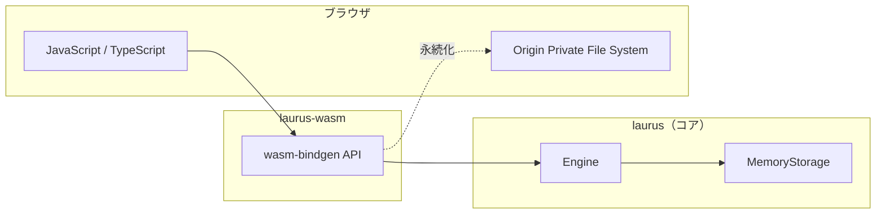

# WASM バインディング概要

`laurus-wasm` パッケージは、Laurus 検索エンジンの WebAssembly バインディングです。
サーバーなしで、ブラウザやエッジランタイム（Cloudflare Workers、Vercel Edge Functions、Deno Deploy）
上で直接、レキシカル検索・ベクトル検索・ハイブリッド検索を実行できます。

## 機能

- **レキシカル検索** -- BM25 スコアリングによる転置インデックスベースの全文検索
- **ベクトル検索** -- Flat、HNSW、IVF インデックスによる近似最近傍探索
- **ハイブリッド検索** -- RRF、WeightedSum による融合アルゴリズム
- **クエリ DSL** -- Term、Phrase、Fuzzy、Wildcard、NumericRange、Geo、Boolean、Span
- **テキスト分析** -- トークナイザー、フィルター、同義語展開
- **インメモリストレージ** -- 高速な一時インデックス
- **OPFS 永続化** -- Origin Private File System によるページリロード後のデータ保持
- **TypeScript 型定義** -- 自動生成される `.d.ts` ファイル
- **非同期 API** -- すべての I/O 操作は Promise を返す

## アーキテクチャ



## Embedding 戦略

ネイティブ環境では Laurus に複数の組み込み Embedder（Candle BERT、Candle CLIP、
OpenAI API）が用意されており、ドキュメントのインデックス時や
`searchVectorText("field", "query text")` 実行時にエンジンが自動で呼び出します。
これらネイティブ Embedder は `wasm32-unknown-unknown` 上で動作しないため、
WASM ビルドでは無効化されています:

| Embedder | Dependency | Why it cannot run in WASM |
| --- | --- | --- |
| `candle_bert` | candle (GPU/SIMD) | Requires native SIMD intrinsics and file system for models |
| `candle_clip` | candle | Same as above |
| `openai` | reqwest (HTTP) | Requires a full async HTTP client (tokio + TLS) |

（これらは `embeddings-candle` / `embeddings-openai` Feature Flags で管理されており、
`wasm32-unknown-unknown` で無効化される `native` feature に依存するため
WASM ビルドから除外されます。）

`laurus-wasm` ではその代わりに以下 2 種類の `addEmbedder` タイプを公開しています:

- **`"precomputed"`** — 呼び出し側が `putDocument()` / `searchVector()` 経由で
  ベクトルを直接渡します。エンジンは埋め込みを行いません。
- **`"callback"`** — JavaScript コールバック
  `embed: (text) => Promise<number[]>` を登録し、エンジンがインジェスト時および
  `searchVectorText()` から呼び出します。Transformers.js 等のブラウザ内埋め込み
  ライブラリと組み合わせることでエンジン内自動埋め込みが実現でき、ネイティブ環境と
  同じく `searchVectorText("field", "query text")` を呼び出すだけで利用できます。

### Option A — 事前計算済みベクトル

**JavaScript 側で埋め込みを計算**し、事前計算済みベクトルを `putDocument()` と
`searchVector()` に渡します:

```javascript
// Transformers.js を使用（all-MiniLM-L6-v2、384次元）
import { pipeline } from '@huggingface/transformers';

const embedder = await pipeline('feature-extraction', 'Xenova/all-MiniLM-L6-v2');

async function embed(text) {
  const output = await embedder(text, { pooling: 'mean', normalize: true });
  return Array.from(output.data);
}

// 事前計算済み埋め込みでインデックス
const vec = await embed("Rust 入門");
await index.putDocument("doc1", { title: "Rust 入門", embedding: vec });
await index.commit();

// 事前計算済みクエリ埋め込みで検索
const queryVec = await embed("安全なシステムプログラミング");
const results = await index.searchVector("embedding", queryVec);
```

このアプローチにより、ネイティブ環境と同じ Sentence Transformer モデルを使った
セマンティック検索がブラウザ内で実現できます。埋め込み計算は candle ではなく
Transformers.js（ONNX Runtime Web）が担当します。

### Option B — Callback Embedder

Transformers.js の同じパイプラインを `"callback"` Embedder として登録すれば、
エンジンが自動で呼び出してくれます。登録後は呼び出し側がベクトルを管理することなく、
インジェストおよび `searchVectorText()` が透過的に動作します:

```javascript
import { pipeline } from '@huggingface/transformers';

const extractor = await pipeline('feature-extraction', 'Xenova/all-MiniLM-L6-v2');

schema.addEmbedder("transformers", {
  type: "callback",
  embed: async (text) => {
    const output = await extractor(text, { pooling: 'mean', normalize: true });
    return Array.from(output.data);
  },
});
schema.addHnswField("embedding", 384, "cosine", undefined, undefined, undefined, "transformers");
const index = await Index.create(schema);

await index.putDocument("doc1", { title: "Rust 入門" });
await index.commit();

const results = await index.searchVectorText("embedding", "安全なシステムプログラミング");
```

Option A と比べると、Callback アプローチではエンジンがインジェスト時に埋め込みを
キャッシュでき、書き込み側と読み出し側で埋め込みコードを重複させずに済みます。
ただし `commit()` のたびに JS コールバックの解決を待つため、大量バルク投入時には
事前計算ベクトルのほうが有利な場合があります。

## laurus-wasm と laurus-nodejs の使い分け

| 基準           | `laurus-wasm`              | `laurus-nodejs`                    |
| -------------- | -------------------------- | ---------------------------------- |
| 実行環境       | ブラウザ、エッジランタイム | Node.js サーバー                   |
| パフォーマンス | 良好（シングルスレッド）   | 最高（ネイティブ、マルチスレッド） |
| ストレージ     | インメモリ + OPFS          | インメモリ + ファイルシステム      |
| 埋め込み       | 事前計算 + JS コールバック | Candle、OpenAI、事前計算           |
| パッケージ     | `npm install laurus-wasm`  | `npm install laurus-nodejs`        |
| バイナリサイズ | 約 5-10 MB（WASM）         | プラットフォームネイティブ         |
