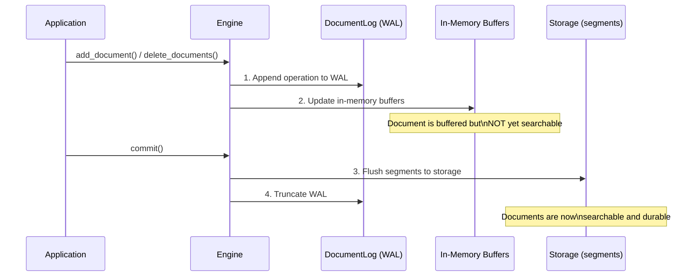
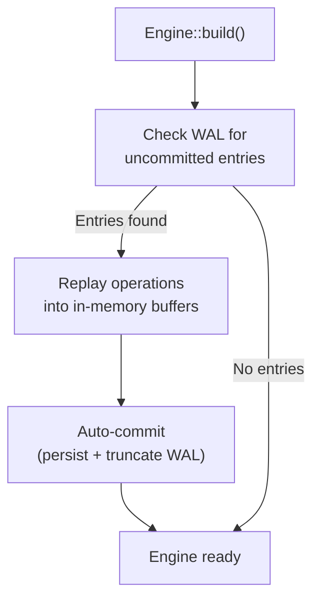

# 永続化とWAL

Laurusはデータの耐久性を確保するために**Write-Ahead Log（WAL）**を使用します。すべての書き込み操作はインメモリ構造を変更する前にWALに永続化され、プロセスがクラッシュした場合でもデータが失われないことを保証します。

## 書き込みパス



### 主要な原則

1. **WALファースト**: すべての書き込み（追加または削除）はインメモリ構造を更新する前にWALに追記されます
2. **バッファリング書き込み**: インメモリバッファが `commit()` が呼ばれるまで変更を蓄積します
3. **アトミックコミット**: `commit()` はすべてのバッファリングされた変更をセグメントファイルにフラッシュし、WALを切り捨てます
4. **クラッシュセーフティ**: 書き込みとコミットの間にプロセスがクラッシュした場合、次回起動時にWALがリプレイされます
5. **アトミックなファイル書き込み**: セグメントファイル（HNSW の `.hnsw` グラフ・そのメタデータ・削除ビットマップなど）は一時ファイルへ書き込んでからアトミックにリネームして配置されるため、書き込み途中のクラッシュでも切り詰められたファイルではなく直前にコミット済みのファイルがそのまま残ります
6. **チェックサム検証**: これらのファイルは CRC-32（`.hnsw` と `.hnsw.f32` rerank sidecar は footer、`metadata.json` と削除ビットマップは framing）を持ち、ロード時に検証されるため、ディスク上の静かな破損を正常データとして読まずに検出できます。チェックサム導入前に書かれたファイルもそのままロードできます（ファイル単位で任意）。また、ローダーはヘッダーを信頼する前にバッファ確保サイズを実ファイルサイズで上限を縛るため、サイズフィールドが破損していても巨大なメモリ確保（OOM）を引き起こさずに破損として拒否します
7. **バージョン付きセグメントヘッダー**: ベクトルセグメントは共有ヘッダーにフォーマットバージョンを持ち、機能のはしごを形成します。バージョン 2（HNSW のみ）はグラフブロックを 64 ビットのドキュメント ID の代わりにセグメントローカルな 32 ビット ordinal で格納します（ディスク上のグラフブロックはおよそ半分になります）。バージョン 3（全ベクトルインデックス型）はセグメントごとのフィールド名辞書を追加し、各レコードはフィールド名をインラインで繰り返す代わりに 16 ビットの ID で参照します（レコードごとに名前の長さ + 2 バイト分縮小されます）。新しいセグメントはバージョン 3 で書き込まれ、古いビルドが書いたセグメント（バージョン 1・2）もそのままロードでき、次の書き直し（コンパクションやマージ）で更新されます

## Write-Ahead Log（WAL）

WALは `DocumentLog` コンポーネントによって管理され、ストレージバックエンドのルートレベル（`engine.wal`）に保存されます。

### WALエントリタイプ

| エントリタイプ | 説明 |
| :--- | :--- |
| **Upsert** | ドキュメント内容 + 外部ID + 割り当てられた内部ID |
| **Delete** | 削除するドキュメントの外部ID |

### WALファイル

WALファイル（`engine.wal`）は追記専用のバイナリログです。各エントリは以下を含む自己完結型です。

- 操作タイプ（add/delete）
- シーケンス番号
- ペイロード（ドキュメントデータまたはID）

### オンディスクのフレーミング

ファイルは 5 バイトのヘッダ（`b"LWAL"` マジック + バージョンバイト）で始まり、長さプレフィックス付きレコードが続きます。フレーミングは 3 種類あり、各ファイルは生涯を通じて単一のフレーミングを保持します（古いファイルは次の commit/truncate 時にのみ現行フォーマットへ書き換えられ、1 ファイル内でフォーマットが混在することはありません）。

| バージョン | フレーミング | ペイロード |
| :--- | :--- | :--- |
| **v3**（現行） | `[u32 len][u32 crc32][payload]` | コンパクトな **rkyv バイナリ** レコード |
| **v2** | `[u32 len][u32 crc32][payload]` | JSON レコード（読み取り専用・後方互換） |
| **legacy**（CRC 以前） | `[u32 len][payload]` | JSON レコード、チェックサムなし（読み取り専用） |

CRC-32（v2/v3）は `len || payload` に対して計算され、長さの破損と本体の破損の両方を検出します。reader は 3 形式すべてを復旧できるため、古いビルドで書かれた WAL もアップグレード後に replay できます。

v3 以降、各ペイロードは JSON ではなくコンパクトな rkyv バイナリレコードです。ベクトルは十進文字列ではなく生の `f32`（各 4 バイト）で格納されるため、ベクトルが多いドキュメントでは WAL がおよそ 2〜3 倍小さくなり、replay もそれに応じて高速化します。耐久性は変わりません（CRC フレーミングとリカバリのセマンティクスは不変）。

## リカバリ

エンジンがビルドされる際（`Engine::builder(...).build().await`）、残っているWALエントリが自動的にチェックされ、リプレイされます（WALはコミット時に切り捨てられるため、残っているエントリはクラッシュしたセッションのものです）。リカバリの最後には**自動コミット**が実行されます。リプレイされた状態 —
[グループコミットで永続化される](deletions.md#グループコミットによる永続化)削除を含む — は
永続化されて即座に検索可能になり、WALは切り捨てられるため、続けてクラッシュしても再リプレイは
発生しません。



リカバリは透過的に行われるため、手動で処理する必要はありません。なお、クラッシュ後のオープンは
コミット相当の処理（セグメントフラッシュ、インデックス書き込み）を行うため、そのコミットが
失敗した場合（ディスクフルなど）は `Engine::build` がエラーを返します。原因解消後の再オープンは
安全です（リプレイは冪等であり、WALはコミット成功後にのみ切り捨てられます）。

## コミットライフサイクル

```rust
// 1. ドキュメントを追加（バッファリングされ、まだ検索不可）
engine.add_document("doc-1", doc1).await?;
engine.add_document("doc-2", doc2).await?;

// 2. コミット — 永続ストレージにフラッシュ
engine.commit().await?;
// ドキュメントが検索可能に

// 3. さらにドキュメントを追加
engine.add_document("doc-3", doc3).await?;

// 4. ここでプロセスがクラッシュした場合、doc-3はWAL内にあり
//    次回起動時にリカバリされます
```

### コミットのタイミング

| 戦略 | 説明 | ユースケース |
| :--- | :--- | :--- |
| **ドキュメントごと** | 最大の耐久性、最小の検索遅延 | 書き込みが少ないリアルタイム検索 |
| **バッチごと** | スループットと遅延の良いバランス | バルクインデキシング |
| **定期的** | 最大の書き込みスループット | 大量データの取り込み |

> **ヒント:** コミットはセグメントをストレージにフラッシュするため比較的コストが高い操作です。バルクインデキシングでは、`commit()` を呼び出す前に多数のドキュメントをバッチ処理してください。

### 自動コミットポリシー（Auto-commit Policy）

自分で `commit()` を呼ぶ代わりに、ビルダーで `CommitPolicy` を設定して、インジェスト駆動のタイミングでエンジンにコミットラダーを自動実行させることができます。

```rust
use laurus::CommitPolicy;

let engine = Engine::builder(storage, schema)
    // 適用ドキュメント 1,000 件ごとに自動コミット。
    .commit_policy(CommitPolicy::EveryDocs(1000))
    .build()
    .await?;

// 明示的な commit() は不要 — 1,000 件目ごとにコミットが発火する。
engine.put_documents(one_thousand_docs).await?;
```

| ポリシー | 挙動 |
| :--- | :--- |
| `Manual`（既定） | 自動コミットしない。すべての `commit()` を自分で駆動する。従来と同一の挙動。 |
| `EveryDocs(n)` | 単数・バッチ両 API を通じて、適用ドキュメント `n` 件ごとにコミットラダーを実行。`EveryDocs(0)` は自動コミット無効（`Manual` と同じ）。 |

主なセマンティクス:

- **group-commit を維持**: 各自動コミットは WAL フラッシュ 1 回 + materialization ラダー 1 回であり、ドキュメントごとのコミットには決してならない。1 回の `put_documents` / `add_documents` 呼び出し内でも自動コミットは **`n` 件ごと**（チャンク単位）に発火するため、大きなバッチは最後にまとめて 1 回ではなく逐次 materialize される。末尾の `< n` 件の端数は次の境界か明示 `commit()` まで WAL durable のまま残る。
- **`WalSyncPolicy` と直交**: `CommitPolicy` は *ストアがいつ materialize するか* を、`WalSyncPolicy` は *WAL fsync の耐久性* を決める。`commit()` は必ず WAL フラッシュから始まるため、自動コミットは任意の WAL ポリシー下で機能する。
- **クラッシュ意味論は不変**: 自動コミットは通常のコミットであり、クラッシュ時は未コミットの tail が手動コミットとまったく同じように再生される。
- **並行性**: 正確なタイミングと「ack した書き込みは durable」という保証は、**単一 writer のインジェスト**（エンジンの書き込みパスが前提とするモデル。CLI・バインディングもこれに従う）で成立する。共有エンジン上の並行 writer 下では auto-commit は best-effort となる: commit ラダーは他スレッドの in-flight write に対してアトミックでないため、並行 auto-commit の実行中に ack された書き込みが次のコミットまで durable にならず、タイミングもドリフトしうる（並行の手動 `commit()` も同じ race を持つ — auto-commit はそれを ingest 経路から誘発するだけ）。並行下でこれらの保証が必要な場合は、明示コミットか単一インジェストタスクを使うこと。

> **注:** 時間ベースの `Interval` ポリシー（*T* 秒ごとにコミット）は計画中です。背景コミットタイマーが必要で、既存コードを壊さずに追加されます。

## バッチインジェスト

`put_documents` / `add_documents` は `put_document` / `add_document` のバッチ形式です。`(id, doc)` ペアを**入力順に逐次適用**し、既定の `PerRecord` ポリシー下ではレコードごとではなく**バッチ末尾の 1 回の WAL fsync** でバッチ全体を durable にします。

```rust
let docs: Vec<(String, Document)> = build_batch();
engine.put_documents(docs).await?; // fsync 1 回で、全ドキュメントが単発 put と同等に durable
engine.commit().await?;            // バッチ全体で 1 回のセグメントフラッシュ
```

留意すべき意味論:

- **順序**: 1 回の `put_documents` バッチ内で重複した外部 ID は、同じ put を逐次発行した場合とまったく同じようにデデュープされます（最後の出現が勝ち）。`add_documents` での ID の繰り返しは正当なマルチチャンク追加です。
- **fail-fast・ロールバックなし**: 適用できない最初のドキュメントでバッチは停止し、`LaurusError::BatchIngest { failed_index, failed_id, applied, .. }` を返します。失敗前に適用された `applied` 件はロールバック**されません** — WAL と NRT バッファに残り（即座に検索可能、次のコミットで永続化、クラッシュ時はリカバリで再生）、エラー経路でもバッチ末尾の WAL フラッシュは実行されます。バッチ全体、または `failed_index` からの suffix の再試行は put 意味論の下で冪等です。
- **耐久性**: 呼び出しが `Ok` を返した時点で、バッチ内の全ドキュメントは成功した単発 put とまったく同等に durable です。呼び出し途中のクラッシュで失われるのは fsync 前の末尾のみで、リカバリは fsync 済み prefix をドキュメント単位で再生し、途中で切れた末尾レコードは通常どおり CRC フレーミングが破棄します。
- **サイズ指針**: エンジンは各ドキュメントを WAL へ順次クローンするため、バッチのメモリは呼び出し側の `Vec` が支配的です。1 回の呼び出しあたり 1,000〜10,000 ドキュメントが良い既定値で、より大きなコーパスは複数回の呼び出しに分割してください（セグメントサイズを抑えるため定期的なコミットも推奨）。
- **`Group` ポリシー下**: バッチ中もグループしきい値は発火し続けるため、同ポリシーの有界な損失ウィンドウは保たれます。バッチ末尾のフラッシュも実行されます。
- **並行する単発書き込み**: 別タスクのバッチ実行中に完了した `put_document` / `add_document` / `delete_documents` は per-record の耐久性を完全に維持します — 単発書き込みは ack 前に fsync を再アサートするため、バッチが他の呼び出し元の保証を弱めることはありません。

## WAL 耐久性ポリシー

既定では、各 `add`/`delete` は返る前に WAL を fsync するため、成功した書き込みがクラッシュで失われることはありません。大量に取り込む場合、この書き込みごとの fsync がスループットのボトルネックになります。`WalSyncPolicy` により、書き込みごとの耐久性とスループットをトレードオフできます。

| ポリシー | 耐久性 | スループット | 相当 |
| :--- | :--- | :--- | :--- |
| `PerRecord`（既定） | 成功した書き込みは必ず durable | 書き込みごとに 1 回 fsync で律速 | SQLite `synchronous = FULL` |
| `Group { max_records, max_bytes }` | クラッシュ時に未 sync の最終バッチまで失う可能性 | fsync をバッチで償却 | SQLite `synchronous = NORMAL` |

`Group` では fsync が遅延され、前回の sync 以降に **`max_records` 件**または **`max_bytes` バイト**のいずれか（先に到達した方）が蓄積した時点で 1 回発行されます。ビルダーで設定します。

```rust
use laurus::WalSyncPolicy;
use std::time::Duration;

let engine = Engine::builder(storage, schema)
    // 既定閾値（1024 件 / 1 MiB）でのグループコミット（timer なし）。
    .wal_sync_policy(WalSyncPolicy::group_with_defaults())
    // ...既定閾値 + 500 ms ごとの定期 flush:
    // .wal_sync_policy(WalSyncPolicy::group_with_interval(Duration::from_millis(500)))
    // ...または任意のバッチサイズと timer を指定:
    // .wal_sync_policy(WalSyncPolicy::Group {
    //     max_records: 4096,
    //     max_bytes: 4 * 1024 * 1024,
    //     max_interval: Some(Duration::from_secs(1)),
    // })
    .build()
    .await?;
```

### 定期 flush タイマー

`Group.max_interval` はサイズベースの閾値に時間上限を加えます。設定すると、エンジンは少なくともその間隔ごとに WAL を強制 durable 化する background timer を起動します。これにより、**低い取り込みレート**（record/byte 閾値に到達しない場合）でも末尾の partial batch が無期限に未 sync のまま残ることを防ぎます。保留中のものが無ければ flush は no-op なので、アイドルな timer のコストはゼロです。`None` で timer を無効化します。

> **WASM 注意:** timer は native ターゲットのみで有効です。`wasm32` には background thread が無いため `max_interval` は無視され、耐久性は record/byte 閾値・`commit()`・`flush_wal()` に依存します。

### 耐久性の保証

- **`commit()` は両ポリシーで hard barrier です。** いずれのストアを materialize する前に WAL を強制的に durable 化するため、WAL がコミット済みインデックスより durability で劣ることはありません。`commit()` 成功後は、ポリシーに関わらず全データが durable です。
- **`flush_wal()` は full commit なしでオンデマンドに flush します。** `Group` におけるクラッシュ時の損失窓を、アプリ任意の地点で抑えるための手段で、SQLite の WAL チェックポイントに相当します。

  ```rust
  engine.add_document("doc-1", doc1).await?;
  engine.flush_wal()?; // セグメントをコミットせずに WAL を durable 化
  ```

- **途中で切れた末尾レコードは決して復活しません。** 各レコードは CRC-32 でフレーミングされ、リカバリ時にチェックサムに失敗した（または切り詰められた）レコードはそれ以降もろとも破棄されます。よって復旧後のログは常にギャップのない有効な接頭辞であり、グループコミットが失うのは直近書き込みの **末尾（suffix）** のみで、それ以前を破損させることはありません。

> **注意:** `Group` はオプトインです。既定の `PerRecord` ポリシーは変更されないため、既存コードは何も変えずに書き込みごとの耐久性を維持します。

## コミット耐久性ラダーとクラッシュ安全性

`commit()` は固定された順序で状態を永続化します。この順序こそが、どの時点でクラッシュ
しても復旧可能であることを保証します。lexical/vector の各ストアはそれぞれ独自の
`last_wal_seq` チェックポイント（materialize 済みの最後の WAL レコードのシーケンス番号）
を持ち、リカバリで適用済みレコードをスキップできます。永続化される `last_wal_seq` は
そのストアのオンディスク metadata に保存され、**ストアの commit 時にのみ**書かれます。

コミットラダーは次のとおりです。

1. **`flush_wal()`** — WAL を強制 durable 化（ハードバリア）。`Group` では遅延バッチを
   fsync し、`PerRecord` では no-op。
2. **`lexical.commit()`** — lexical セグメントと metadata（`last_wal_seq` を含む）を書き、
   `sync()`。
3. **`vector.commit()`** — vector セグメントを書き、`sync()`。
4. **`commit_documents()`** — document store セグメントを書き、`sync()`。
5. **`truncate()`** — WAL を空の fsync 済みファイルで置き換える。

この順序は次の 2 つの不変条件を保証します。

- **WAL は永続化された index より durable でないことはない。** `last_wal_seq` はステップ 2
  以降でのみ永続化され、必ずステップ 1 のバリアの後に実行されるため、コミット済み index が
  まだ durable でない WAL レコードを参照することはありません。
- **すべてのストアは WAL が truncate される前に完全に durable 化される。** ステップ 2〜4 は
  ステップ 5 が WAL を空にする前にそれぞれ `sync()` するため、WAL はそれが記述したデータが
  安全に materialize された後にのみ破棄されます。

リカバリは次回の `build()` で WAL を replay し、各ストアの `last_wal_seq` 以下のレコードを
スキップします。replay は**冪等（idempotent）**です。各レコードを元々記録された `doc_id`
の下で再適用するため、再実行は重複ではなく上書きになります。各ストアが独自のチェックポイント
を持つため、途中で失敗した commit は各ストアを異なる `last_wal_seq` のまま残し、リカバリは
各ストアに不足している分だけを再適用します。（vector store は現状チェックポイントを `0` の
まま保持するため、毎回のリカバリで保持中の WAL を全件 replay します。正しく冪等ですが、
最適化はまだです。）

次の表は各ステップでクラッシュした場合の結果を示します（ステップ 1 のバリアが既に走っている
ため、`PerRecord` と `Group` で同一です）。

| クラッシュ地点 | ディスク上で durable | リカバリの結果 |
| --- | --- | --- |
| ステップ 1 の後、2 の前 | WAL のみ | 保留中の全レコードを両ストアへ replay |
| ステップ 2 の後、3 の前 | WAL + lexical（`last_wal_seq = N`） | lexical は ≤ N をスキップ、vector は WAL から replay |
| ステップ 3 の後、4 の前 | WAL + lexical + vector | 両ストアがスキップ、documents は WAL から復元 |
| ステップ 4 の後、5 の前 | WAL + 全ストア | WAL は残存、両ストアがスキップ、重複なし |
| ステップ 5 の後 | 全ストア、WAL は空 | replay 対象なし |

コミット済み index が失われた WAL レコードを参照する interleaving は存在しないため、group
commit は文書化された契約（`flush_wal()` や `commit()` でまだ durable 化されていない書き込みの
*末尾* をクラッシュで失い得る）を超える新たな耐久性ギャップを生みません。

## ストレージレイアウト

エンジンは `PrefixedStorage` を使用してデータを整理します。

```text
<storage root>/
├── lexical/          # 転置インデックスセグメント
│   ├── seg-000/
│   │   ├── terms.dict
│   │   ├── postings.post
│   │   └── ...
│   └── metadata.json
├── vector/           # ベクトルインデックスセグメント
│   ├── seg-000/
│   │   ├── graph.hnsw
│   │   ├── vectors.vecs
│   │   └── ...
│   └── metadata.json
├── documents/        # ドキュメントストレージ
│   └── ...
└── engine.wal        # Write-Ahead Log
```

## 次のステップ

- 削除の処理方法: [削除とコンパクション](deletions.md)
- ストレージバックエンド: [Storage](../concepts/storage.md)
