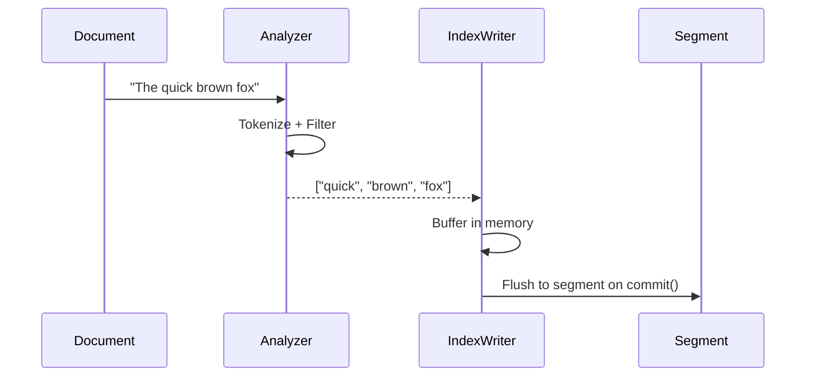
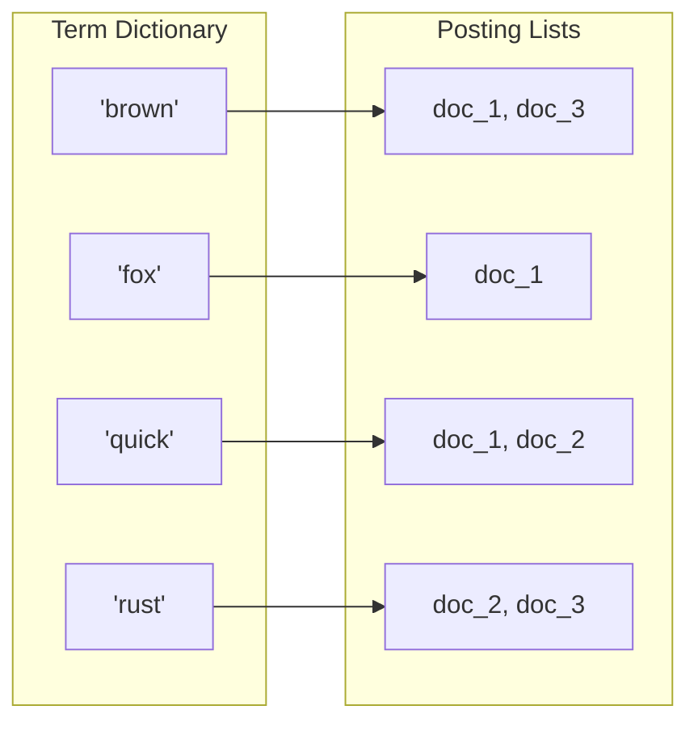
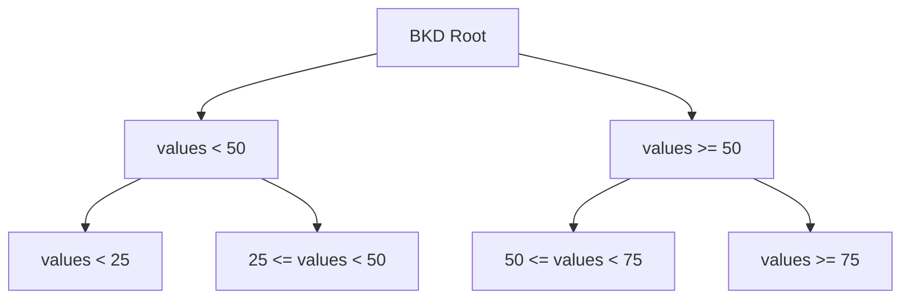
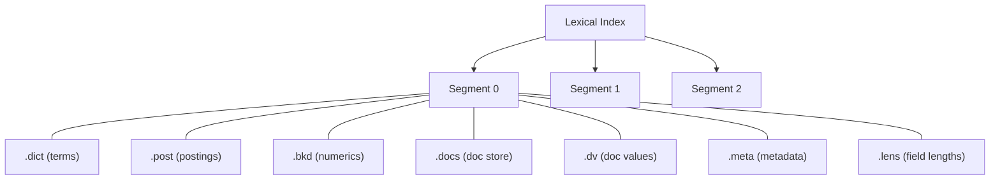

# Lexical Indexing

Lexical indexing powers keyword-based search. When a document's text field is indexed, Laurus builds an **inverted index** — a data structure that maps terms to the documents containing them.

## How Lexical Indexing Works



### Step by Step

1. **Analyze**: The text passes through the configured analyzer (tokenizer + filters), producing a stream of normalized terms
2. **Buffer**: Terms are stored in an in-memory write buffer, organized by field
3. **Commit**: On `commit()`, the buffer is flushed to a new segment on storage

## The Inverted Index

An inverted index is essentially a map from terms to document lists:



| Component | Description |
| :--- | :--- |
| **Term Dictionary** | Sorted list of all unique terms in the index; supports fast prefix lookup |
| **Posting Lists** | For each term, a list of document IDs and metadata (term frequency, positions) |
| **Doc Values** | Column-oriented storage for sort/filter operations on numeric and date fields |

### Posting List Contents

Each entry in a posting list contains:

| Field | Description |
| :--- | :--- |
| Document ID | Internal `u64` identifier (per-segment value must fit in `u32`) |
| Term Frequency | How many times the term appears in this document |
| Positions (optional) | Where in the document the term appears (needed for phrase queries) |
| Weight | Score weight for this posting |

### On-Disk Posting Layout

Posting lists are stored in a **structure-of-arrays** layout with each field
written as its own contiguous section. Document IDs and term frequencies are
encoded in fixed-size **128-int blocks** using bit-packing (Frame-of-Reference
plus sorted-delta for doc IDs), with any partial trailing block falling back
to varint. This matches the on-disk format used by Tantivy and Lucene 9 and
yields fast SIMD-accelerated decoding through the
[`bitpacking`](https://crates.io/crates/bitpacking) crate.

```text
[term, total_frequency, doc_frequency, posting_count N, any_positions]
[Section 1: doc_ids       — N/128 bit-packed blocks + varint tail]
[Section 2: frequencies   — N/128 bit-packed blocks + varint tail]
[Section 3: weights       — N raw f32 values]
[Section 4: positions     — per-posting flag + varint deltas (only if any)]
```

Per-segment doc IDs must fit in `u32`. Encoding a value beyond `u32::MAX`
fails fast with a clear error to prevent silent corruption of the
bit-packed segment.

## Numeric and Date Fields

Integer, float, and datetime fields are indexed using a **[BKD tree](../bkd_tree.md)** — a space-partitioning data structure optimized for range queries:



BKD trees allow efficient evaluation of range queries like `price:[10 TO 100]` or `date:[2024-01-01 TO 2024-12-31]`.

## Geo Fields

Geographic fields come in two flavours, both backed by the same multi-dimensional
[BKD-Tree](../bkd_tree.md) primitive:

| Field type | Dimensions | Coordinates | Supported queries |
| :--- | :---: | :--- | :--- |
| `Geo` | 2 | WGS84 latitude / longitude (degrees) | radius, bounding box |
| `Geo3d` | 3 | ECEF Cartesian `(x, y, z)` in metres | 3D distance (sphere), 3D bounding box, k-nearest neighbours |

`Geo3d` is the right choice when altitude is a first-class dimension —
drones, satellites, indoor 3D positioning, or anything else that a 2D
`Geo` field would lose or distort near the poles. See
[3D Geographic Search (ECEF)](../geo3d.md) for the coordinate system,
WGS84 conversion helpers, and DSL syntax.

## Segments

The lexical index is organized into **segments**. Each segment is an immutable, self-contained mini-index:



| File Extension | Contents |
| :--- | :--- |
| `.dict` | Term dictionary (sorted terms + metadata offsets) |
| `.post` | Posting lists (document IDs, term frequencies, positions) |
| `.bkd` | [BKD tree](../bkd_tree.md) data for numeric, date, `Geo` (2D), and `Geo3d` (3D ECEF) fields |
| `.docs` | Stored field values (the original document content) |
| `.dv` | Doc values for sorting and filtering |
| `.meta` | Segment metadata (doc count, term count, etc.) |
| `.lens` | Field length norms (for BM25 scoring) |

### Segment Lifecycle

1. **Create**: A new segment is created each time `commit()` is called
2. **Search**: All segments are searched in parallel and results are merged
3. **Merge**: Periodically, multiple small segments are merged into larger ones to improve query performance
4. **Delete**: When a document is deleted, its ID is added to a deletion bitmap rather than physically removed (see [Deletions & Compaction](../../laurus/deletions.md))

## BM25 Scoring

Laurus uses the BM25 algorithm to score lexical search results. BM25 considers:

- **Term Frequency (TF)**: how often the term appears in the document (more = better, with diminishing returns)
- **Inverse Document Frequency (IDF)**: how rare the term is across all documents (rarer = more important)
- **Field Length Normalization**: shorter fields are boosted relative to longer ones

The formula:

```text
score(q, d) = IDF(q) * (TF(q, d) * (k1 + 1)) / (TF(q, d) + k1 * (1 - b + b * |d| / avgdl))
```

Where `k1 = 1.2` and `b = 0.75` are the default tuning parameters.

## SIMD Optimization

Vector distance calculations leverage SIMD (Single Instruction, Multiple Data) instructions when available, providing significant speedups for similarity computations in vector search.

## Code Example

```rust
use std::sync::Arc;
use laurus::{Document, Engine, Schema};
use laurus::lexical::TextOption;
use laurus::lexical::core::field::IntegerOption;
use laurus::storage::memory::MemoryStorage;

#[tokio::main]
async fn main() -> laurus::Result<()> {
    let storage = Arc::new(MemoryStorage::new(Default::default()));
    let schema = Schema::builder()
        .add_text_field("title", TextOption::default())
        .add_text_field("body", TextOption::default())
        .add_integer_field("year", IntegerOption::default())
        .build();

    let engine = Engine::builder(storage, schema).build().await?;

    // Index documents
    engine.add_document("doc-1", Document::builder()
        .add_text("title", "Rust Programming")
        .add_text("body", "Rust is a systems programming language.")
        .add_integer("year", 2024)
        .build()
    ).await?;

    // Commit to flush segments to storage
    engine.commit().await?;

    Ok(())
}
```

## Next Steps

- Learn how vector indexes work: [Vector Indexing](vector_indexing.md)
- Run queries against the lexical index: [Lexical Search](../search/lexical_search.md)
