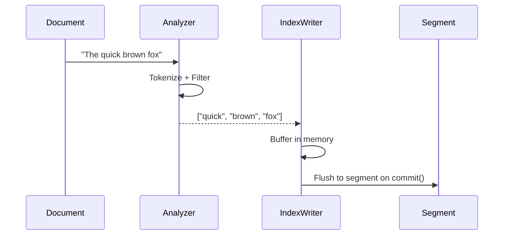
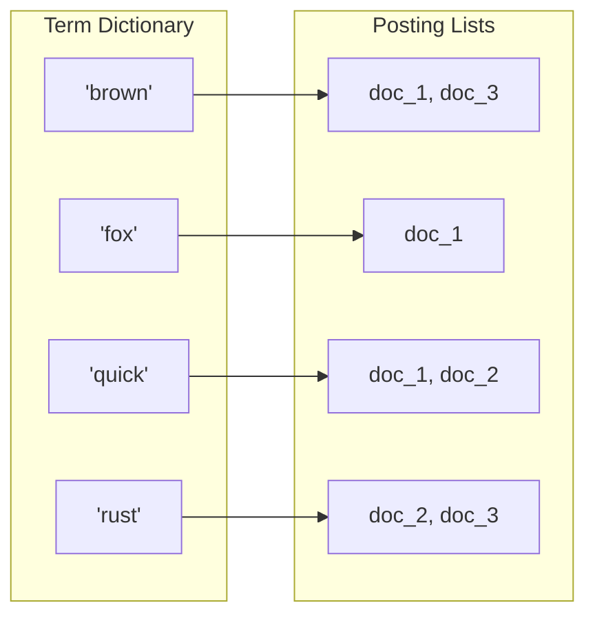
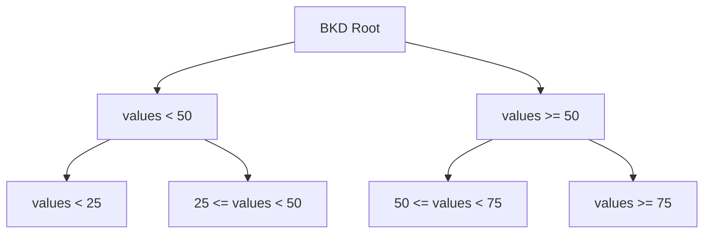
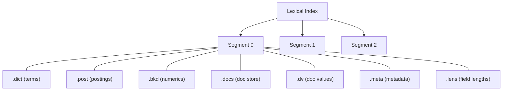

# Lexical Indexing

Lexical indexing powers keyword-based search. When a document's text field is indexed, Laurus builds an **inverted index** — a data structure that maps terms to the documents containing them.

## How Lexical Indexing Works



### Step by Step

1. **Analyze**: The text passes through the configured analyzer (tokenizer + filters), producing a stream of normalized terms
2. **Buffer**: Terms are stored in an in-memory write buffer, organized by field
3. **Commit**: On `commit()`, the buffer is flushed to a new segment on storage

## The Inverted Index

An inverted index is essentially a map from terms to document lists:



| Component | Description |
| :--- | :--- |
| **Term Dictionary** | Sorted dictionary of unique terms in the index. Disk format is a Lucene `BlockTreeTermsWriter`-style block-tree (FST over per-block representative terms + front-coded term bytes inside each 128-term block + bit-packed `TermInfo`); in-memory is an `AHashMap`-indexed parallel-array query layer populated at load time. Disk format minimises file size, in-memory layer keeps `get` / `iter` / prefix-scan at parallel-array speed. Supports exact lookup, ordered iteration, and prefix scans. |
| **Posting Lists** | For each term, a list of document IDs and metadata (term frequency, positions) |
| **Doc Values** | Column-oriented storage for sort/filter operations on numeric and date fields |

### Posting List Contents

Each entry in a posting list contains:

| Field | Description |
| :--- | :--- |
| Document ID | Internal `u64` identifier (per-segment value must fit in `u32`) |
| Term Frequency | How many times the term appears in this document |
| Positions (optional) | Where in the document the term appears (needed for phrase queries) |
| Weight | Score weight for this posting |

### On-Disk Posting Layout

Posting lists are stored in a **structure-of-arrays** layout with each field
written as its own contiguous section. Document IDs and term frequencies are
encoded in fixed-size **128-int blocks** using bit-packing (Frame-of-Reference
plus sorted-delta for doc IDs), with any partial trailing block falling back
to varint. This matches the on-disk format used by Tantivy and Lucene 9 and
yields fast SIMD-accelerated decoding through the
[`bitpacking`](https://crates.io/crates/bitpacking) crate.

```text
[term, total_frequency, doc_frequency, posting_count N, any_positions]
[Skip levels              — v2 only: num_levels + per-level (len + u32 doc_ids)]
[Section 1: doc_ids       — N/128 bit-packed blocks + varint tail]
[Section 2: frequencies   — N/128 bit-packed blocks + varint tail]
[Section 3: weights       — N raw f32 values]
[Section 4: positions     — per-posting flag + varint deltas (only if any)]
```

Per-segment doc IDs must fit in `u32`. Encoding a value beyond `u32::MAX`
fails fast with a clear error to prevent silent corruption of the
bit-packed segment.

The decoder exposes a SoA-native fast path (`PostingList::decode_soa`) that
produces parallel `Vec<u32>` slices for `doc_id` and `frequency` directly
from disk without the intermediate `Vec<Posting>` reassembly. The query
iterator stores those slices, so `next()` advances a single `u32` cursor
over a dense slice instead of striding across a 40-byte `Posting` struct.

### Multi-Level Skip Table

A posting list of `N ≥ 8` postings carries a Lucene-90-style
multi-level skip table immediately after the header (v2 format,
introduced for `skip_to` performance on seek-heavy workloads).
Each level stores the "last doc id" of a fixed-stride window over
`doc_ids`; level 0 has one entry per `SKIP_INTERVAL = 8` postings,
level 1 covers `8²` postings, and so on until the top level
collapses to a single entry.

`PostingIterator::skip_to(target)` walks the table top-down: at each
level a single `partition_point` narrows the search window by a factor
of `SKIP_INTERVAL`, descends one level, and finishes with a linear
scan over the bottom-level window of at most 8 postings. Total work
is `O(log_8 N + SKIP_INTERVAL)` per call — for `N = 1 M` that is
~25 comparisons, versus the linear `O(N / block_size)` walk the
single-level `block_cache` paid before.

The table is co-located with the posting list rather than stored in a
separate file, matching Lucene 9 / Tantivy. Segments written in the
legacy v1 format (without the on-disk skip table) remain readable —
the SoA decoder rebuilds the table from `doc_ids` at load time.

### Term Dictionary Storage Layers

The dictionary uses a **two-layer** representation that decouples
on-disk compactness from in-memory query speed:

- **Disk layer** — the `.dict` file uses a Lucene
  `BlockTreeTermsWriter`-style block-tree layout (magic `LTDD`,
  schema v1). This produces a compact file: at 100k unique 5-10 byte
  terms a `.dict` is ~12.5 bytes / term, roughly **70 % smaller** than
  the prior parallel-array on-disk format.
- **In-memory query layer** — at build / load time the dictionary
  populates an `AHashMap<term, ordinal>` index, an
  ordinal-indexed sorted `Vec<String>`, and a single-copy
  `Arc<[TermInfo]>`. `get` / `iter` / `find_prefix` / `find_range`
  operate exclusively on these structures, so per-query cost matches
  the prior parallel-array implementation (no per-call FST traversal
  or in-block linear scan).

The disk-format scratch (FST + BlockSection bytes) is retained only so
[`BlockTermDictionary::write_to_storage`] can re-serialise the
dictionary on segment merge without re-encoding from scratch.

```text
[Header                ]  magic "LTDD" + version
[FstSection            ]  fst::Map<u64> keyed by each block's last term,
                          valued by that block's start byte offset
[BlockSection          ]  concatenated 128-term blocks, each containing
                          front-coded term bytes, a bit-packed
                          fixed-size TermInfo block, and a
                          variable-length per-term Block-Max-WAND
                          metadata array
[Footer                ]  total term count + block count
```

Lookup walks the FST once (`O(|term|)`) to identify the block whose
last term is `≥ target`, then performs a linear front-coded scan
inside the block (≤ 128 entries). Iteration walks the BlockSection
sequentially without consulting the FST, decoding each block's
front-coded prefix once and reusing the buffer across terms. Prefix
scans combine the two: FST seek to the first matching block, then
sequential block walk until the prefix no longer matches.

Compared to a flat per-term FST the block-head FST is one to two
orders of magnitude smaller, and the front-coded block bytes plus
bit-packed `TermInfo` typically cut the on-disk size by 50-80 % at
production scale.

## Numeric and Date Fields

Integer, float, and datetime fields are indexed using a **[BKD tree](../bkd_tree.md)** — a space-partitioning data structure optimized for range queries:



BKD trees allow efficient evaluation of range queries like `price:[10 TO 100]` or `date:[2024-01-01 TO 2024-12-31]`.

## Geo Fields

Geographic fields come in two flavours, both backed by the same multi-dimensional
[BKD-Tree](../bkd_tree.md) primitive:

| Field type | Dimensions | Coordinates | Supported queries |
| :--- | :---: | :--- | :--- |
| `Geo` | 2 | WGS84 latitude / longitude (degrees) | radius, bounding box |
| `Geo3d` | 3 | ECEF Cartesian `(x, y, z)` in metres | 3D distance (sphere), 3D bounding box, k-nearest neighbours |

`Geo3d` is the right choice when altitude is a first-class dimension —
drones, satellites, indoor 3D positioning, or anything else that a 2D
`Geo` field would lose or distort near the poles. See
[3D Geographic Search (ECEF)](../geo3d.md) for the coordinate system,
WGS84 conversion helpers, and DSL syntax.

## Segments

The lexical index is organized into **segments**. Each segment is an immutable, self-contained mini-index:



| File Extension | Contents |
| :--- | :--- |
| `.dict` | Term dictionary in the v1 `LTDD` block-tree layout (FST over per-block representative terms + 128-term blocks of front-coded term bytes + bit-packed `TermInfo`). Loaded into an `AHashMap`-backed in-memory query layer at segment open. |
| `.post` | Posting lists (document IDs, term frequencies, positions) |
| `.bkd` | [BKD tree](../bkd_tree.md) data for numeric, date, `Geo` (2D), and `Geo3d` (3D ECEF) fields |
| `.docs` | Stored field values (the original document content) |
| `.dv` | Doc values for sorting and filtering |
| `.meta` | Segment metadata (doc count, term count, etc.) |
| `.lens` | Field length norms (for BM25 scoring) |

### Segment Lifecycle

1. **Create**: A new segment is created each time `commit()` is called
2. **Search**: All segments are searched in parallel and results are merged
3. **Merge**: Periodically, multiple small segments are merged into larger ones to improve query performance
4. **Delete**: When a document is deleted, its ID is added to a deletion bitmap rather than physically removed (see [Deletions & Compaction](../../laurus/deletions.md))

## BM25 Scoring

Laurus uses the BM25 algorithm to score lexical search results. BM25 considers:

- **Term Frequency (TF)**: how often the term appears in the document (more = better, with diminishing returns)
- **Inverse Document Frequency (IDF)**: how rare the term is across all documents (rarer = more important)
- **Field Length Normalization**: shorter fields are boosted relative to longer ones

The formula:

```text
score(q, d) = IDF(q) * (TF(q, d) * (k1 + 1)) / (TF(q, d) + k1 * (1 - b + b * |d| / avgdl))
```

Where `k1 = 1.2` and `b = 0.75` are the default tuning parameters.

## SIMD Optimization

Vector distance calculations leverage SIMD (Single Instruction, Multiple Data) instructions when available, providing significant speedups for similarity computations in vector search.

## Code Example

```rust
use std::sync::Arc;
use laurus::{Document, Engine, Schema};
use laurus::lexical::TextOption;
use laurus::lexical::core::field::IntegerOption;
use laurus::storage::memory::MemoryStorage;

#[tokio::main]
async fn main() -> laurus::Result<()> {
    let storage = Arc::new(MemoryStorage::new(Default::default()));
    let schema = Schema::builder()
        .add_text_field("title", TextOption::default())
        .add_text_field("body", TextOption::default())
        .add_integer_field("year", IntegerOption::default())
        .build();

    let engine = Engine::builder(storage, schema).build().await?;

    // Index documents
    engine.add_document("doc-1", Document::builder()
        .add_text("title", "Rust Programming")
        .add_text("body", "Rust is a systems programming language.")
        .add_integer("year", 2024)
        .build()
    ).await?;

    // Commit to flush segments to storage
    engine.commit().await?;

    Ok(())
}
```

## Next Steps

- Learn how vector indexes work: [Vector Indexing](vector_indexing.md)
- Run queries against the lexical index: [Lexical Search](../search/lexical_search.md)
