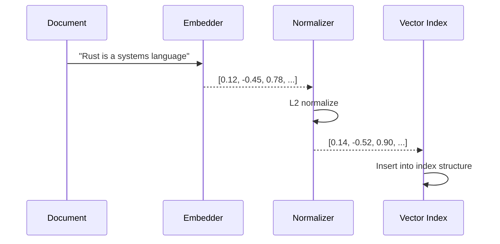
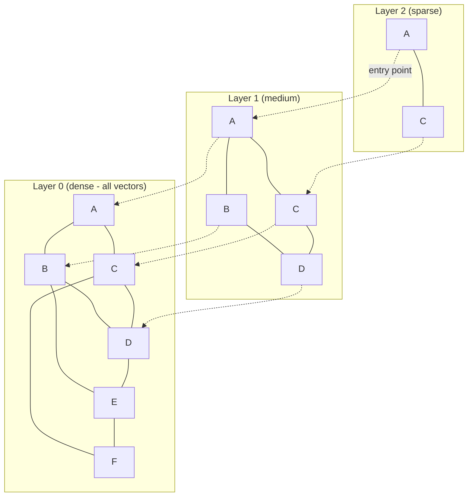
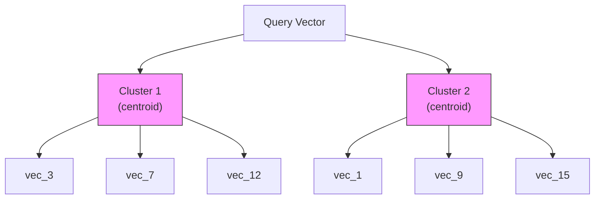

# Vector Indexing

Vector indexing powers similarity-based search. When a document's vector field is indexed, Laurus stores the embedding vector in a specialized index structure that enables fast approximate nearest neighbor (ANN) retrieval.

## How Vector Indexing Works



### Step by Step

1. **Embed**: The text (or image) is converted to a vector by the configured embedder
2. **Normalize**: The vector is L2-normalized **only for the Cosine metric** (a magnitude-invariant metric). Euclidean, DotProduct, and Manhattan fields keep their original vectors so their distances are preserved
3. **Index**: The vector is inserted into the configured index structure (Flat, HNSW, or IVF)
4. **Commit**: On `commit()`, the index is flushed to persistent storage

## Index Types

Laurus supports three vector index types, each with different performance characteristics:

### Comparison

| Property | Flat | HNSW | IVF |
| :--- | :--- | :--- | :--- |
| **Accuracy** | 100% (exact) | ~95-99% (approximate) | ~90-98% (approximate) |
| **Search speed** | O(n) linear scan | O(log n) graph walk | O(n/k) cluster scan |
| **Memory usage** | Low | Higher (graph edges) | Moderate (centroids) |
| **Index build time** | Fast | Moderate | Slower (clustering) |
| **Best for** | < 10K vectors | 10K - 10M vectors | > 1M vectors |

### Flat Index

The simplest index. Compares the query vector against every stored vector (brute-force).

```rust
use laurus::vector::FlatOption;
use laurus::vector::core::distance::DistanceMetric;

let opt = FlatOption {
    dimension: 384,
    distance: DistanceMetric::Cosine,
    ..Default::default()
};
```

- **Pros**: 100% recall (exact results), simple, low memory
- **Cons**: Slow for large datasets (linear scan)
- **Use when**: You have fewer than ~10,000 vectors, or you need exact results

### HNSW Index

**Hierarchical Navigable Small World** graph. The default and most commonly used index type.



The HNSW algorithm searches from the top (sparse) layer down to the bottom (dense) layer, narrowing the search space at each level.

```rust
use laurus::vector::HnswOption;
use laurus::vector::core::distance::DistanceMetric;

let opt = HnswOption {
    dimension: 384,
    distance: DistanceMetric::Cosine,
    m: 16,                  // max connections per node per layer
    ef_construction: 200,   // search width during index building
    ..Default::default()
};
```

#### HNSW Parameters

| Parameter | Default | Description | Impact |
| :--- | :--- | :--- | :--- |
| `m` | 16 | Max bi-directional connections per layer | Higher = better recall, more memory |
| `ef_construction` | 200 | Search width during index building | Higher = better recall, slower build |
| `dimension` | 128 | Vector dimensions | Must match embedder output |
| `distance` | Cosine | Distance metric | See Distance Metrics below |

**Tuning tips:**

- Increase `m` (e.g., 32 or 64) for higher recall at the cost of memory
- Increase `ef_construction` (e.g., 400) for better index quality at the cost of build time
- At search time, the `ef_search` parameter (set in the search request) controls the search width

### IVF Index

**Inverted File Index**. Partitions vectors into clusters, then only searches relevant clusters.



```rust
use laurus::vector::IvfOption;
use laurus::vector::core::distance::DistanceMetric;

let opt = IvfOption {
    dimension: 384,
    distance: DistanceMetric::Cosine,
    n_clusters: 100,   // number of clusters
    n_probe: 10,       // clusters to search at query time
    ..Default::default()
};
```

#### IVF Parameters

| Parameter | Default | Description | Impact |
| :--- | :--- | :--- | :--- |
| `n_clusters` | 100 | Number of Voronoi cells | More clusters = faster search, lower recall |
| `n_probe` | 1 | Clusters to search at query time | Higher = better recall, slower search |
| `dimension` | (required) | Vector dimensions | Must match embedder output |
| `distance` | Cosine | Distance metric | See Distance Metrics below |

**Tuning tips:**

- Set `n_clusters` to roughly `sqrt(n)` where `n` is the number of vectors
- Set `n_probe` to 5-20% of `n_clusters` for a good recall/speed trade-off
- IVF requires a training phase — initial indexing may be slower

## Distance Metrics

| Metric | Description | Range | Best For |
| :--- | :--- | :--- | :--- |
| `Cosine` | 1 - cosine similarity | [0, 2] | Text embeddings (most common) |
| `Euclidean` | L2 distance | [0, +inf) | Spatial data |
| `Manhattan` | L1 distance | [0, +inf) | Feature vectors |
| `DotProduct` | Negative inner product | (-inf, +inf) | Pre-normalized vectors |
| `Angular` | Angular distance | [0, pi] | Directional similarity |

```rust
use laurus::vector::core::distance::DistanceMetric;

let metric = DistanceMetric::Cosine;      // Default for text
let metric = DistanceMetric::Euclidean;    // For spatial data
let metric = DistanceMetric::Manhattan;    // L1 distance
let metric = DistanceMetric::DotProduct;   // For pre-normalized vectors
let metric = DistanceMetric::Angular;      // Angular distance
```

> **Note:** Vectors are automatically L2-normalized before indexing **only for the `Cosine` metric**. Normalizing is magnitude-invariant, so it is safe for Cosine (and additionally tightens the int8 quantization range), but it would change the distances of magnitude-sensitive metrics — so `Euclidean`, `DotProduct`, and `Manhattan` fields are stored without normalization. Lower distance = more similar.
>
> **Migration note:** non-Cosine fields created before this behavior was corrected have L2-normalized vectors on disk (the original magnitudes are not recoverable). Rebuild such an index to get correct distances.

## Quantization

Vectors are stored on disk as **8-bit scalar-quantized integers**
(Issue #481 Stage 1). Compared to the previous 32-bit float storage
this is **~4x smaller** with negligible recall loss in practice
(Recall@10 remains ≥ 0.95 against the f32 ground truth — see the
recall test at `laurus/tests/vector_recall_test.rs`).

| Method | Enum Variant | Description | Memory Reduction |
| :--- | :--- | :--- | :--- |
| **Scalar 8-bit** *(default)* | `Scalar8Bit` | Per-segment global affine quantization to `u8` | ~4x |
| **Product Quantization** | `ProductQuantization { subvector_count }` | Stage 3 of #481 — codebook of `M × 256` centroids (trained per segment, or [trained once and shared](#shared-pq-codebook-issue-631) via `pq_codebook_path`), each vector stored as `M` bytes | ~16-64x (HNSW-only) |

```rust
use laurus::vector::HnswOption;
use laurus::vector::core::quantization::QuantizationMethod;

// `quantizer` defaults to `Scalar8Bit`; the explicit form below is
// equivalent to `HnswOption { dimension: 384, ..Default::default() }`.
let opt = HnswOption {
    dimension: 384,
    quantizer: QuantizationMethod::Scalar8Bit,
    ..Default::default()
};
```

> **Breaking change (Issue #481 Stage 1):** the `quantizer` field is no
> longer `Option<QuantizationMethod>`; quantization is mandatory and
> defaults to `Scalar8Bit`. There is no longer an unquantized (f32)
> on-disk format. Existing pre-Stage-1 vector indexes are intentionally
> not readable by this version — rebuild the index from source data.

### How Scalar8Bit works

- Each segment trains a single **global** `(offset, scale)` pair from
  its f32 vectors at flush time (`offset = min`, `scale = (max - min) / 255`).
- Each `f32` element is encoded as `u8 = clamp(round((v - offset) / scale), 0, 255)`.
- Per-vector metadata (`sum_q: u32`, `norm_q: f32`) is precomputed and
  persisted alongside the int8 payload so the cosine search hot loop
  collapses to one int8 SIMD multiply-accumulate plus three scalar
  corrections — no per-element dequantization at search time.
- Segment files start with the `LVS1` magic + a 16-byte header so the
  reader can detect the format at load time. The header carries a
  version (a feature ladder: v2 = ordinal-encoded HNSW graph block,
  v3 = per-segment field-name dictionary) and, from v3 on, the
  dictionary itself — records then reference field names by a 16-bit
  id instead of repeating the full name inline.

### Two-stage rerank (Issue #481 Stage 2)

Stage 1 stores vectors as int8 only. The graph search runs entirely
against int8 distances, which is fast but introduces a small
quantization error. Stage 2 adds an **optional** per-field f32
sidecar so the searcher can rescore the top candidates against the
original full-precision vectors:

1. The HNSW int8 graph search returns up to `ef_search` candidates
   ranked by quantized cosine distance.
2. The top `top_k * rerank_factor` candidates are rescored against
   the f32 vectors loaded from the
   [LRS1 sidecar](#lrs1-rerank-sidecar) (`*.hnsw.f32`).
3. The new ranking is truncated to `top_k` and returned.

Since #932 the same sidecar mechanism serves Flat and IVF too (the
shared `RerankPipeline`, #650); the description below uses HNSW, the
original Stage-2 host. Stage 2 is opt-in per field via
[`HnswOption.rerank_storage`](../../laurus-cli/schema_format.md#rerank-storage):

```rust
use laurus::vector::HnswOption;
use laurus::vector::core::rerank::RerankStorageKind;

let opt = HnswOption {
    rerank_storage: Some(RerankStorageKind::F32),
    ..HnswOption::default()
};
```

Queries pass the rerank factor through `VectorIndexQuery::rerank_factor`
(low-level), `SearchRequestBuilder::vector_rerank_factor` (engine), or
the gRPC / JSON `VectorParams.rerank_factor` field.

Fields without `rerank_storage` enabled silently fall back to the
Stage 1 int8 ranking even when `rerank_factor` is set — there is no
f32 information to recover from a Stage 1 segment.

#### LRS1 rerank sidecar

The sidecar is a separate file written next to the LVS1 segment when
`rerank_storage` is enabled:

```text
offset  size  field
------  ----  -------------------------------------------
     0     4  magic         ASCII "LRS1"
     4     2  version       u16 LE  (current = 1)
     6     2  storage_kind  u16 LE  (1 = F32; 0 reserved; 2.. future)
     8     8  reserved      zero-padded
    16     4  dim           u32 LE
    20     4  vector_count  u32 LE
    24     -  payload       vector_count * dim * bytes_per_element
   end     8  footer        magic "LRC1" u32 LE + CRC-32 u32 LE
                             over header + payload
```

Vectors are written in the same `(doc_id, field_name)` order as the
matching LVS1 segment, so a (sidecar position) → (LVS1 position)
mapping is the identity. The HNSW reader loads the sidecar into a
`RerankStoragePool` at init time when the storage loading mode is
Eager; Lazy mode skips the sidecar to honor its memory-savings
promise (Stage 2 segments opened in Lazy mode silently degrade to
Stage 1).

The sidecar is enabled per field by `rerank_storage` in the schema's
HNSW options, and that setting is honored on every write path: direct
commits, the active write segment, and segment merges all re-emit the
sidecar for the segment they produce. A merged segment's sidecar is
rebuilt from the **source segments' original f32 sidecars** (not from
the int8-dequantized segment data), so a merge stays lossless for the
rerank vectors instead of compounding one round of quantization error
per merge.

New sidecars end with an 8-byte CRC-32 footer over the header and
payload that is verified whenever the sidecar is read (both the
searcher load and the writer reload), so silent on-disk corruption is
rejected instead of skewing rerank scores. Because the header fully
determines the content length, the footer is detected by the bytes
remaining after the payload — sidecars written before the footer was
introduced have zero trailing bytes and still load, with verification
skipped.

#### Bounded allocations from on-disk header counts

Every vector segment header carries element counts (`num_vectors`,
`n_clusters`, the HNSW graph's `node_count` / `layer_count` /
`neighbor_count`) and per-record byte lengths (the v1/v2 inline `field_name_len`, PQ
`codes`) that the reader uses to size `Vec` / `HashMap` capacities and
read buffers. The HNSW CRC footer is verified before the structural
parse, but legacy footer-less segments — and the writer reload paths,
which run no footer verification — reach those counts unverified. A
single flipped byte could otherwise turn a small count into a multi-GiB
allocation request that aborts the process through `handle_alloc_error`
(out of memory) before any corruption check runs.

To prevent that, the HNSW, Flat, and IVF loaders bound each such
allocation against ground truth — the true file length from
`StorageInput::size()`. Because the bytes a count or buffer describes
must physically exist in the file, a header that declares more elements
or bytes than the file can hold is rejected as a corrupted segment
*before* the allocation. This generalizes the rerank sidecar's
file-size bound to the main segment readers and covers legacy
footer-less segments, so a corrupt or hostile header surfaces a clean
"corrupted segment" error rather than an OOM abort.

#### Recall vs speed trade-off

`rerank_factor` lets you exchange a small per-query rerank cost
(~`top_k * rerank_factor` exact-distance calls — a few µs at dim
128) for higher Recall@10. The gain depends on the corpus and the
graph search budget (`ef_search`):

- Real clustered embedding data (text-embedding-3, BERT, etc.)
  reaches `Recall@10 ≥ 0.99` at low `ef_search`; rerank polishes
  the ranking with negligible latency overhead.
- Synthetic random unit-norm data (the worst case for HNSW recall
  recovery) needs a higher `ef_search` for the int8 graph to visit
  enough true top-10 candidates; rerank then re-orders the visited
  set but cannot retrieve candidates the graph never reached.

The recall acceptance is split into two CI gates so the rerank
kernel and the full HNSW pipeline can fail independently:

- `stage2_brute_force_rerank_recall_at_10_meets_kernel_gate` asserts
  `Recall@10 ≥ 0.99`. Bypasses the HNSW graph entirely (brute-force
  int8 over the corpus, widen to `top_k * rerank_factor`, rescore
  with f32) so any miss is a rerank-kernel regression.
- `hnsw_quantized_recall_at_10_with_rerank_meets_stage2_recall_gate`
  asserts `Recall@10 ≥ 0.98`. Adds the HNSW graph-construction
  non-determinism that an f32 HNSW baseline would also contribute;
  the looser gate matches the observed run-to-run variance band on
  this synthetic adversarial distribution. Real clustered embedding
  data and a stronger HNSW config (m=32, ef_construction=500) reach
  ≥ 0.99 on this path too — see the diagnostic sweep below.

The companion `stage2_recall_sweep_diagnostic` (opt-in via
`LAURUS_STAGE2_SWEEP=1`) sweeps `(ef_search, rerank_factor)` across
three corpus / query distributions and two HNSW configs so
production deployments can calibrate the budget for their actual
embedding distribution.

#### Real-data validation (Issue #498)

A third opt-in CI gate validates Stage 2 against a real ANN
benchmark dataset (SIFT1M from TEXMEX) so the synthetic-data gates
above do not become the only signal:

- `hnsw_quantized_recall_at_10_with_rerank_on_sift_meets_stage2_real_data_recall_gate`
  asserts `Recall@10 ≥ 0.99` on a 50 000-vector SIFT1M subsample at
  `(m=16, ef_construction=200, ef_search=200, rerank_factor=5)`.
- The companion bench `bench_hnsw_graph_search_rerank_real_data` (in
  `laurus/benches/vector_search_bench.rs`) measures end-to-end Stage 2
  latency on the same fixture. The accompanying example
  `laurus/examples/sift_rerank_probe.rs` runs a full
  `(ef_search × rerank_factor × HNSW config)` sweep with `(Recall,
  latency)` per cell so operators can pick the operating point for
  their own data shape.

Both are gated on `LAURUS_REAL_BENCHMARK=1` AND the presence of the
SIFT1M `.fvecs` files under `.cache/sift/sift/`. Default CI runs are
unchanged. To enable locally:

```sh
./scripts/fetch-sift.sh --large   # ~478MB
LAURUS_REAL_BENCHMARK=1 cargo test --release \
    --test vector_recall_test \
    hnsw_quantized_recall_at_10_with_rerank_on_sift_meets_stage2_real_data_recall_gate \
    -- --nocapture
LAURUS_REAL_BENCHMARK=1 cargo bench --bench vector_search_bench \
    -- "HNSW Graph Search Rerank Real"
```

The Issue #481 wording originally asked for "≥ 3× speedup vs the
pre-Stage-1 f32 baseline." Cross-branch Criterion measurements on
SIFT1M-50k (median over 30 samples, same `(m, ef_construction,
ef_search)`) gave 625 µs/query on the pre-Stage-1 f32 HNSW path
versus 323 µs/query on the Stage 2 int8 + rerank path — a **1.94×**
speedup. Issue #498 reduces the real-data gate to **≥ 1.5×**
accordingly, with the recall side held at the original 0.99. The
gap between the original 3× target and the measured 1.94× comes
from rerank only re-ordering candidates the int8 graph traversal
already visited — a lower `ef_search` does not pay back through
rerank when the candidate set itself becomes too narrow, which a
follow-up could address by widening the graph search budget
independently of `ef_search` (the Lucene 99 pattern).

### Product Quantization with rerank (Issue #481 Stage 3)

Stage 3 adds an opt-in **Product Quantization** path for the HNSW
index. Each segment trains a per-field codebook of `M` sub-vectors
× `K = 256` centroids using Lloyd k-means with k-means++
initialisation, and stores every vector as `M` bytes (one centroid
index per sub-vector). The search hot loop replaces the int8 SIMD
kernel with **asymmetric distance computation** (ADC): per-query
the searcher builds an `M × K` look-up table of squared distances
between the query's sub-vectors and the codebook entries, then
scores each candidate as `Σ_m lut[m][codes[m]]` — `M` table
lookups + `M − 1` adds per candidate.

PQ is enabled per field via `HnswOption.quantizer`:

```rust
use laurus::vector::HnswOption;
use laurus::vector::core::quantization::QuantizationMethod;
use laurus::vector::core::rerank::RerankStorageKind;

let opt = HnswOption {
    dimension: 128,
    quantizer: QuantizationMethod::ProductQuantization { subvector_count: 32 },
    // PQ-only Recall@10 caps out around 0.78-0.92 on SIFT1M, so
    // production deployments should pair PQ with the LRS1 rerank
    // sidecar — same Stage 2 mechanism, just driven by PQ
    // candidate generation instead of int8.
    rerank_storage: Some(RerankStorageKind::F32),
    ..Default::default()
};
```

`subvector_count` must divide `dimension`. Common choices for
`dim = 128`: `M ∈ {8, 16, 32}` (sub_dim 16 / 8 / 4). Larger `M`
trades on-disk compression for higher recall — Issue #481 Stage 3
ships only the 8-bit (K = 256) variant; the on-disk format reserves
a 4-bit (K = 16) slot for a future PR.

**Minimum training size**: PQ trains `K = 256` k-means centroids per
sub-quantizer, so a segment with fewer than 256 vectors cannot train a
meaningful codebook. Such segments are written as **Scalar8Bit**
instead (the `LVS1` header is self-describing, so readers dispatch on
the stored kind transparently); once the segment grows — or is merged
into a larger one — the next write trains PQ as configured. The
`subvector_count`-divides-`dimension` validation still applies
regardless of segment size. Neither the fallback nor the minimum
applies when a [shared codebook](#shared-pq-codebook-issue-631) is
configured: nothing is trained per segment in that case, so even tiny
per-commit segments stay on PQ.

#### Shared PQ codebook (Issue #631)

By default every segment write trains its own codebook from scratch —
a multi-second k-means cost that recurs on **every commit and every
merge** under the segment-per-commit layout (#634/#889). Following the
FAISS / Lucene99 precedent, a codebook can instead be trained **once**
on a representative sample and reused by every subsequent segment
write, reducing the encode step to a table lookup (measured ~91-92%
faster than inline training at 2 048-8 192 vectors).

Enable it by naming a codebook file on the field and training it:

```toml
[fields.embedding.Hnsw]
dimension = 128
pq_codebook_path = "embedding.pqcb"

[fields.embedding.Hnsw.quantizer.ProductQuantization]
subvector_count = 32
```

```shell
laurus train pq-codebook --field embedding --input vectors.jsonl --update-schema
```

(or `--from-index` in place of `--input` to sample vectors already
committed to the index; or fold training into index creation with
`laurus create index --train-pq-codebook <jsonl>`, which removes the
train-before-first-commit ordering hazard entirely — both Issue #920),
or programmatically via
[`Engine::train_pq_codebook`](https://docs.rs/laurus/latest/laurus/struct.Engine.html)
(`engine.train_pq_codebook("embedding", &vectors, None)`; pair with
`engine.sample_committed_vectors("embedding", Some(n))` for the
from-index flow). Training is CPU-bound and synchronous; thousands of
representative vectors are enough — the full corpus is not required.

Semantics:

- **The segment format is unchanged.** The shared codebook is still
  embedded inline in each segment header, so shared-codebook and
  inline-trained segments coexist with no migration, and the codes are
  **byte-identical** to what inline training on the same sample would
  produce.
- The codebook file is resolved **once, at index open**. Retraining
  while an engine is open does not hot-swap the codebook mid-session
  (intentional — a codebook must not change between the commits of one
  session); reopen the engine to pick up a new file.
- **Failure policy — no silent fallback.** A configured but
  not-yet-trained `pq_codebook_path` is lenient at open (so a schema
  can be created before training), but a commit that needs to encode
  hard-errors with the training command to run. A present but
  corrupt or geometry-mismatched file errors at open. Laurus never
  silently falls back to per-segment training — an invisible
  regression to the multi-second training cost would defeat the
  feature.
- Cosine-metric fields L2-normalize the training sample the same way
  the writer normalizes indexed vectors, so the codebook basis always
  matches (the #794 trap).

#### On-disk format

PQ segments use the same `LVS1` header as Scalar8Bit (`quant_kind =
2`) and carry the codebook inside the per-segment metadata block:

```text
[ Fixed header           16 bytes ]
[ PQ params               8 bytes ]    m / k / sub_dim / padding (u16 × 4)
[ Codebook                m × k × sub_dim × 4 bytes ]
[ Per-vector codes        num_vectors × m bytes ]
```

For `dim = 128, M = 32, K = 256`: codebook = `32 × 256 × 4 × 4 =
131 072 bytes` (128 KB) per segment plus 32 bytes per vector.

#### Recall and speed gates (Issue #481 Stage 3)

- **Kernel-level test** — synthetic 5 000-vector / dim 128 / 100
  queries at `(m=16, ef_construction=200, ef_search=200,
  rerank_factor=10, M=32)`:
  `hnsw_pq_rerank_recall_at_10_meets_stage3_recall_gate` asserts
  Recall@10 ≥ 0.95. Measured 0.9660.
- **Real-data test** — SIFT1M-50k subsample (opt-in via
  `LAURUS_REAL_BENCHMARK=1`, same config):
  `hnsw_pq_rerank_recall_at_10_on_sift_meets_stage3_real_data_recall_gate`
  asserts Recall@10 ≥ 0.95. Measured 0.9965.
- **Real-data speed bench** —
  `bench_hnsw_graph_search_pq_rerank_real_data` (opt-in,
  Criterion). Cross-branch measurement at the same SIFT1M-50k
  config: pre-Stage-1 f32 HNSW = 625.21 µs/query (PR #500);
  Stage 3 PQ + rerank = **299.54 µs/query** = **2.09× speedup**.

Issue #481 originally asked for ≥ 5× speedup at Recall ≥ 0.95.
The PR established that target is not reachable on SIFT1M with the
current implementation — both Stage 2 (#500) and this Stage 3 PR
have measured speedups in the 1.9-2.1× band because rerank
dominates the wall-clock once the candidate set is wide enough to
recover recall. The gate was reduced to ≥ 1.5× accordingly. A
follow-up could pursue the Lucene 99 pattern (independent graph
search budget) and / or a 4-bit PQ variant to close the gap.

#### PQ → SQ → f32 three-stage rerank (Issue #673)

Stage 3's rerank widens the PQ ADC candidate set to `top_k *
rerank_factor` and rescores only that leading slice against the
exact f32 sidecar — anything the graph traversal found beyond that
budget is discarded. Setting `ef_search` wider than `top_k *
rerank_factor` used to buy nothing beyond that budget on a PQ field;
since #673 it activates an extra **int8 (SQ) stage** that
re-ranks the *entire* `ef_search`-sized candidate set by a cheap
int8 kernel before the narrow exact-stage budget is carved out of
it — so the surplus the graph already computed gets a chance to
compete on a much better proxy (int8) than the PQ ADC order it
arrived in, instead of being thrown away unscored.

The int8 view is **derived from the same LRS1 f32 sidecar** the
exact stage reads (trained once, lazily, on first use, and cached
for the segment's lifetime) — no second on-disk sidecar, no new
per-field configuration, and no new query parameter. The chain
activates automatically, per query, whenever all of the following
hold:

- the field is PQ-quantized (`ProductQuantization` or
  `ProductQuantizationFastScan`);
- a rerank sidecar (`rerank_storage: Some(F32)`) is loaded;
- `rerank_factor` is set on the query; and
- `effective_ef_search > top_k * rerank_factor` — i.e. the graph
  traversal actually computed more candidates than the exact stage
  alone would consume. When it doesn't (the common case where
  `ef_search` is left at its default), the SQ stage would narrow
  nothing and is skipped, so the query takes the identical two-stage
  (PQ → f32) path it always has.

The `score_basis` contract (Issue #927) is unaffected either way:
the pipeline still ends in the exact f32 stage, so multi-segment
fan-out keeps treating those scores as the exact, cross-segment-
comparable basis regardless of whether an SQ stage ran ahead of it.

## Segment Files

| Index Type | File Extension | Contents |
| :--- | :--- | :--- |
| HNSW | `.hnsw` | Graph structure, vectors, and metadata |
| Flat | `.flat` | Raw vectors and metadata |
| IVF | `.ivf` | Cluster centroids, assigned vectors, and metadata |

All three index types default to the **segment-per-commit** layout (see
below); the monolithic single-file layout remains available via
`{Flat,Hnsw,Ivf}IndexConfig { segmented: false, .. }` for direct index
users.

### Segment-per-commit layout (default for all three index types)

Since [#634](https://github.com/mosuka/laurus/issues/634) (HNSW) and
[#889](https://github.com/mosuka/laurus/issues/889) (Flat and IVF), each
commit seals only the **newly added vectors** as an immutable
`segment_NNNNNN.{hnsw,flat,ivf}` file and registers it in an atomic,
checksummed `segments.json` manifest — the per-commit cost drops from
O(index) to O(new documents), with no full-corpus rework for the existing
segments:

- **Search** fans out over the sealed segments (newest generation first)
  and deduplicates same-document copies with newest-wins masking, so a
  re-indexed document always resolves to its latest embedding. An adaptive
  over-fetch — expanding the per-segment budget geometrically until enough
  live hits survive masking — keeps result quality stable even when a deep
  band of stale copies awaits a merge.
- **Merging**: a tiered, generation-contiguous merge policy collapses
  size-similar segment runs as ingest proceeds (each vector is rewritten
  O(log N) times over its lifetime), and `optimize()` force-merges
  everything into one segment. IVF's merge does not try to reconcile
  per-segment cluster ids (they carry no cross-segment meaning): it
  flattens the deduplicated survivors and retrains centroids from scratch
  over the merged union, with the cluster count re-derived adaptively for
  the union's size. Flat has no f32 rerank sidecar to fall back on, so each
  merge dequantizes, retrains scalar-quantization parameters, and
  requantizes — a small amount of quantization drift accumulates across
  merges, unlike HNSW's/IVF's lossless-ish requantization path.
- **Per-segment training**: HNSW's graphs and IVF's centroids are both
  built independently per segment — IVF adapts its cluster count to each
  segment's own size (capped by the schema's `n_clusters`) rather than
  training a fixed count regardless of how many vectors landed in that
  commit. No cross-segment agreement is needed for either index type,
  since search fans out per segment and merges top-k results.
- **Deletions** are logical: an index-level bitmap (`{name}.delmap`) is
  consulted by every segment reader and physically reclaimed by merges.
- **Migration** is zero-copy: an existing monolithic segment file is
  registered verbatim as the first segment on first open — one manifest
  write, no data movement.
- **Durability**: segment files and the manifest are written via
  temp-file + fsync + atomic rename, and the manifest carries the WAL
  checkpoint published only after all covered state is durable — see
  [Persistence](../../laurus/persistence.md).

### Writer retention across commits (monolithic layout only)

Retention only applies to the **monolithic** layout (`segmented: false`);
a segmented writer always starts from an empty buffer, so there is nothing
to retain. For the monolithic HNSW layout, the store keeps its writer
cached **across commits** (Issue #864): after a commit the writer's
in-memory state is equivalent to the file it just wrote, so the first
upsert after a commit extends it in place instead of reloading (and
dequantizing) the whole `.hnsw` from storage — under commit-heavy ingest
that reload was O(index size) per cycle. The cache is dropped whenever the
index is rewritten *behind* the writer — auto-compaction firing inside a
commit, or an explicit `optimize()` — because both rebuild the file
through a fresh writer and clear the deletion bitmap, and a stale retained
writer would write the reclaimed vectors back — and whenever a commit
fails partway, where the writer/disk agreement is unknown. As a bonus, a
retained writer with no pending changes skips the index rewrite entirely,
so a no-change `commit()` costs no `.hnsw` write at all. The monolithic
Flat and IVF layouts keep the previous drop-on-commit behavior, unaudited
for the same invariants — reaching for that code path today requires
opting out of the segmented default explicitly.

## Code Example

```rust
use std::sync::Arc;
use laurus::{Document, Engine, Schema};
use laurus::lexical::TextOption;
use laurus::vector::HnswOption;
use laurus::vector::core::distance::DistanceMetric;
use laurus::storage::memory::MemoryStorage;

#[tokio::main]
async fn main() -> laurus::Result<()> {
    let storage = Arc::new(MemoryStorage::new(Default::default()));
    let schema = Schema::builder()
        .add_text_field("title", TextOption::default())
        .add_hnsw_field("embedding", HnswOption {
            dimension: 384,
            distance: DistanceMetric::Cosine,
            m: 16,
            ef_construction: 200,
            ..Default::default()
        })
        .build();

    // With an embedder, text in vector fields is automatically embedded
    let engine = Engine::builder(storage, schema)
        .embedder(my_embedder)
        .build()
        .await?;

    // Add text to the vector field — it will be embedded automatically
    engine.add_document("doc-1", Document::builder()
        .add_text("title", "Rust Programming")
        .add_text("embedding", "Rust is a systems programming language.")
        .build()
    ).await?;

    engine.commit().await?;

    Ok(())
}
```

## Next Steps

- Search the vector index: [Vector Search](../search/vector_search.md)
- Combine with lexical search: [Hybrid Search](../search/hybrid_search.md)
