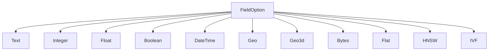
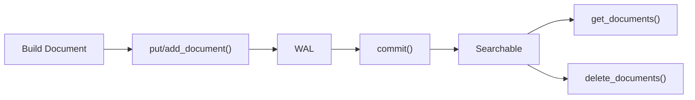

# Schema & Fields

The `Schema` defines the structure of your documents — what fields exist and how each field is indexed. It is the single source of truth for the Engine.

> For the TOML file format used by the CLI, see [Schema Format Reference](../laurus-cli/schema_format.md).

## Schema

A `Schema` is a collection of named fields. Each field is either a **lexical field** (for keyword search) or a **vector field** (for similarity search).

```rust
use laurus::Schema;
use laurus::lexical::TextOption;
use laurus::lexical::core::field::IntegerOption;
use laurus::vector::HnswOption;

let schema = Schema::builder()
    .add_text_field("title", TextOption::default())
    .add_text_field("body", TextOption::default())
    .add_integer_field("year", IntegerOption::default())
    .add_hnsw_field("embedding", HnswOption::default())
    .add_default_field("body")
    .build();
```

### Default Fields

`add_default_field()` specifies which field(s) are searched when a query does not explicitly name a field. This is used by the [Query DSL](../concepts/query_dsl.md) parser.

## Field Types



### Lexical Fields

Lexical fields are indexed using an inverted index and support keyword-based queries.

| Type | Rust Type | SchemaBuilder Method | Description |
| :--- | :--- | :--- | :--- |
| **Text** | `TextOption` | `add_text_field()` | Full-text searchable; tokenized by the analyzer |
| **Integer** | `IntegerOption` | `add_integer_field()` | 64-bit signed integer; supports range queries |
| **Float** | `FloatOption` | `add_float_field()` | 64-bit floating point; supports range queries |
| **Boolean** | `BooleanOption` | `add_boolean_field()` | `true` / `false` |
| **DateTime** | `DateTimeOption` | `add_datetime_field()` | UTC timestamp; supports range queries |
| **Geo** | `GeoOption` | `add_geo_field()` | Latitude/longitude pair; supports radius and bounding box queries |
| **Geo3d** | `Geo3dOption` | `add_geo3d_field()` | 3D ECEF Cartesian point (`x`, `y`, `z` in metres); supports 3D distance, bounding box, and k-NN queries. See [3D Geographic Search](geo3d.md). |
| **Bytes** | `BytesOption` | `add_bytes_field()` | Raw binary data |

#### Text Field Options

`TextOption` controls how text is indexed:

```rust
use laurus::lexical::TextOption;

// Default: indexed + stored + term vectors (all true)
let opt = TextOption::default();

// Customize
let opt = TextOption::default()
    .indexed(true)
    .stored(true)
    .term_vectors(true);
```

| Option | Default | Description |
| :--- | :--- | :--- |
| `indexed` | `true` | Whether the field is searchable |
| `stored` | `true` | Whether the original value is stored for retrieval |
| `term_vectors` | `true` | Whether term positions are stored (needed for phrase queries and highlighting) |

### Vector Fields

Vector fields are indexed using vector indexes for approximate nearest neighbor (ANN) search.

| Type | Rust Type | SchemaBuilder Method | Description |
| :--- | :--- | :--- | :--- |
| **Flat** | `FlatOption` | `add_flat_field()` | Brute-force linear scan; exact results |
| **HNSW** | `HnswOption` | `add_hnsw_field()` | Hierarchical Navigable Small World graph; fast approximate |
| **IVF** | `IvfOption` | `add_ivf_field()` | Inverted File Index; cluster-based approximate |

#### HNSW Field Options (most common)

```rust
use laurus::vector::HnswOption;
use laurus::vector::core::distance::DistanceMetric;

let opt = HnswOption {
    dimension: 384,                          // vector dimensions
    distance: DistanceMetric::Cosine,        // distance metric
    m: 16,                                   // max connections per layer
    ef_construction: 200,                    // construction search width
    base_weight: 1.0,                        // default scoring weight
    quantizer: None,                         // optional quantization
};
```

See [Vector Indexing](indexing/vector_indexing.md) for detailed parameter guidance.

## Document

A `Document` is a collection of named field values. Use `DocumentBuilder` to construct documents:

```rust
use laurus::Document;

let doc = Document::builder()
    .add_text("title", "Introduction to Rust")
    .add_text("body", "Rust is a systems programming language.")
    .add_integer("year", 2024)
    .add_float("rating", 4.8)
    .add_boolean("published", true)
    .build();
```

### Indexing Documents

The `Engine` provides two methods for adding documents, each with different semantics:

| Method | Behavior | Use Case |
| :--- | :--- | :--- |
| `put_document(id, doc)` | **Upsert** — if a document with the same ID exists, it is replaced | Standard document indexing |
| `add_document(id, doc)` | **Append** — adds the document as a new chunk; multiple chunks can share the same ID | Chunked/split documents (e.g., long articles split into paragraphs) |

```rust
// Upsert: replaces any existing document with id "doc1"
engine.put_document("doc1", doc).await?;

// Append: adds another chunk under the same id "doc1"
engine.add_document("doc1", chunk2).await?;

// Always commit after indexing
engine.commit().await?;
```

### Retrieving Documents

Use `get_documents` to retrieve all documents (including chunks) by external ID:

```rust
let docs = engine.get_documents("doc1").await?;
for doc in &docs {
    if let Some(title) = doc.get("title") {
        println!("Title: {:?}", title);
    }
}
```

### Deleting Documents

Delete all documents and chunks sharing an external ID:

```rust
engine.delete_documents("doc1").await?;
engine.commit().await?;
```

### Document Lifecycle



> **Important:** Documents are not searchable until `commit()` is called.

### DocumentBuilder Methods

| Method | Value Type | Description |
| :--- | :--- | :--- |
| `add_text(name, value)` | `String` | Add a text field |
| `add_integer(name, value)` | `i64` | Add an integer field |
| `add_float(name, value)` | `f64` | Add a float field |
| `add_boolean(name, value)` | `bool` | Add a boolean field |
| `add_datetime(name, value)` | `DateTime<Utc>` | Add a datetime field |
| `add_vector(name, value)` | `Vec<f32>` | Add a pre-computed vector field |
| `add_geo(name, lat, lon)` | `(f64, f64)` | Add a 2D geographic point (WGS84) |
| `add_geo_ecef(name, x, y, z)` | `(f64, f64, f64)` | Add a 3D ECEF Cartesian point (metres) |
| `add_bytes(name, data)` | `Vec<u8>` | Add binary data |
| `add_field(name, value)` | `DataValue` | Add any value type |

## DataValue

`DataValue` is the unified value enum that represents any field value in Laurus:

```rust
pub enum DataValue {
    Null,
    Bool(bool),
    Int64(i64),
    Float64(f64),
    Text(String),
    Bytes(Vec<u8>, Option<String>),  // (data, optional MIME type)
    Vector(Vec<f32>),
    DateTime(DateTime<Utc>),
    Geo(GeoPoint),                   // 2D WGS84 point (latitude, longitude)
    GeoEcef(GeoEcefPoint),           // 3D ECEF Cartesian point (x, y, z) in metres
    Int64Array(Vec<i64>),            // multi-valued integer field
    Float64Array(Vec<f64>),          // multi-valued float field
}
```

`DataValue` implements `From<T>` for common types, so you can use `.into()` conversions:

```rust
use laurus::DataValue;

let v: DataValue = "hello".into();       // Text
let v: DataValue = 42i64.into();         // Int64
let v: DataValue = 3.14f64.into();       // Float64
let v: DataValue = true.into();          // Bool
let v: DataValue = vec![0.1f32, 0.2].into(); // Vector
```

## Reserved Fields

Any field name starting with an underscore (`_`) is **reserved for the
engine**. User code cannot declare fields with such names, and documents that
carry user-supplied `_`-prefixed keys are rejected at ingest time.

The only `_`-prefixed name that is accepted is the allow-listed `_id`
system field described below.

### `_id` — external document identifier

Stores the external document ID supplied to `put_document` / `add_document`.
It is injected automatically and indexed with `KeywordAnalyzer` (exact match).
You do not need to add it to your schema.

## Dynamic Schema

Laurus can accept documents even when some of their fields have not been
declared in the schema. The behaviour is controlled by the
`DynamicFieldPolicy` attached to the schema:

| Policy | Behaviour on an undeclared field |
| :--- | :--- |
| `Strict` | Reject the document with a descriptive error. |
| `Dynamic` (default) | Infer the field's type from the value and add it to the schema. |
| `Ignore` | Silently drop the field and continue indexing the rest. |

Set the policy on the builder:

```rust
use laurus::{DynamicFieldPolicy, Schema};

let schema = Schema::builder()
    .dynamic_field_policy(DynamicFieldPolicy::Dynamic)
    .build();
```

### Type inference rules (Dynamic policy)

| Incoming value | Inferred field type |
| :--- | :--- |
| `string` | `Text` (BM25 via the inverted index) |
| `integer` | `Integer` (BKD tree) |
| `float` | `Float` (BKD tree) |
| `bool` | `Boolean` |
| array of integers (e.g. `[1, 2, 3]`) | `Integer` with `multi_valued = true` |
| array of floats / mixed numeric (e.g. `[1.5, 2.0, 3]`) | `Float` with `multi_valued = true` |
| object with a latitude key (`lat` or `latitude`) and a longitude key (`lon`, `lng`, or `longitude`), values in range | `Geo` |
| object with all three numeric keys `x`, `y`, `z` (finite values, ECEF meters) | `Geo3d` |

Vector fields (`Hnsw`, `Flat`, `Ivf`) and `Bytes` are **never** inferred:
they must be declared in the schema explicitly. Mixing 2D (`lat`/`lon`)
and 3D (`x`/`y`/`z`) markers in a single object is rejected as ambiguous;
use either shape, not both.

### Multi-valued numeric fields

Integer and Float fields can be declared with `multi_valued = true` to
hold multiple values per document. A range query matches a document if
**any** of its values satisfies the predicate (Lucene-style "any match"
semantics with constant scoring — there is no per-match BM25 weighting).

Single values sent to a multi-valued field are auto-wrapped into a
one-element array; arrays sent to a single-valued field are rejected
rather than silently truncating.

### Type conflicts

When a value arrives for a field that is **already declared**, Laurus attempts
to coerce the value to the declared type. The coercion rules are:

| Declared type | Incoming value | Result |
| :--- | :--- | :--- |
| `Integer` | `Int64` | stored as-is |
| `Integer` | `Float64(3.14)` | **truncated to `3`** (information loss — see warning below) |
| `Integer` | `Text("42")` | parsed as `42` |
| `Integer` | `Text("abc")` | error |
| `Float` | `Int64` | widened to `f64` |
| `Float` | `Text("3.14")` | parsed |
| `Boolean` | `Int64(0)` / `Int64(1)` | `false` / `true` |
| `Boolean` | `Text("true"/"false")` | parsed (case-insensitive) |
| `Text` | any scalar | stringified |
| `Geo` / `Geo3d` / `Bytes` / vector | anything other than matching variant | error |

Coercion errors interact with the policy:

- `Strict`: error is returned immediately.
- `Dynamic`: error is returned — the coercion layer already applied every
  conversion that is considered safe.
- `Ignore`: the offending field is dropped; the rest of the document is
  indexed.

> **⚠️ Warning: silent information loss is possible.**
>
> Several coercions throw away information without reporting an error:
>
> - An `Integer` field **truncates** incoming `Float` values (`3.14` → `3`,
>   `-3.9` → `-3`). Ingest does not fail.
> - A `Float` field may lose precision for very large integers that do not
>   fit in an `f64` mantissa.
> - A `Text` field accepts any scalar by stringifying it, losing the
>   original type.
> - `Ignore` drops incompatible fields quietly.
>
> If the correctness of your data matters more than the convenience of
> schema-less ingestion, use `DynamicFieldPolicy::Strict` (or declare every
> field up-front). The `Dynamic` policy prioritises keeping the document
> ingestable over preserving every bit of incoming data.

### Query DSL and undeclared fields

Once the schema is settled, the query parser validates that every
`field:value` clause references a declared field. Typos such as
`titl:hello` (for `title:hello`) produce a clear parse error instead of
returning silently-empty results.

## Dynamic Field Management

Fields can be added to or removed from a running engine at runtime.
Type changes are not supported—remove the field and re-add it with the
new type instead.

### Adding a Field

Use `Engine::add_field()` to add a new field to the schema.

#### Adding a Lexical Field

```rust,ignore
let updated_schema = engine.add_field(
    "category",
    FieldOption::Text(TextOption::default()),
).await?;
```

#### Adding a Vector Field

```rust,ignore
let updated_schema = engine.add_field(
    "embedding",
    FieldOption::Flat(FlatOption::default().dimension(384)),
).await?;
```

Existing documents are unaffected—they simply have no value for the new
field. The returned `Schema` should be persisted (e.g., to `schema.toml`)
by the caller.

### Removing a Field

Use `Engine::delete_field()` to remove a field from the schema.

```rust,ignore
let updated_schema = engine.delete_field("category").await?;
```

When a field is deleted:

- The field definition is removed from the schema.
- Existing indexed data for the field **remains** in the index but becomes
  inaccessible through queries.
- If the field was listed in `default_fields`, it is automatically removed.
- Any per-field analyzer or embedder registered for the field is
  unregistered.

## Schema Design Tips

1. **Separate lexical and vector fields** — a field is either lexical or vector, never both. For hybrid search, create separate fields (e.g., `body` for text, `body_vec` for vector).

2. **Use `KeywordAnalyzer` for exact-match fields** — category, status, and tag fields should use `KeywordAnalyzer` via `PerFieldAnalyzer` to avoid tokenization.

3. **Choose the right vector index** — use HNSW for most cases, Flat for small datasets, IVF for very large datasets. See [Vector Indexing](indexing/vector_indexing.md).

4. **Set default fields** — if you use the Query DSL, set default fields so users can write `hello` instead of `body:hello`.

5. **Use the schema generator** — run `laurus create schema` to interactively build a schema TOML file instead of writing it by hand. See [CLI Commands](../laurus-cli/commands.md#create-schema).
