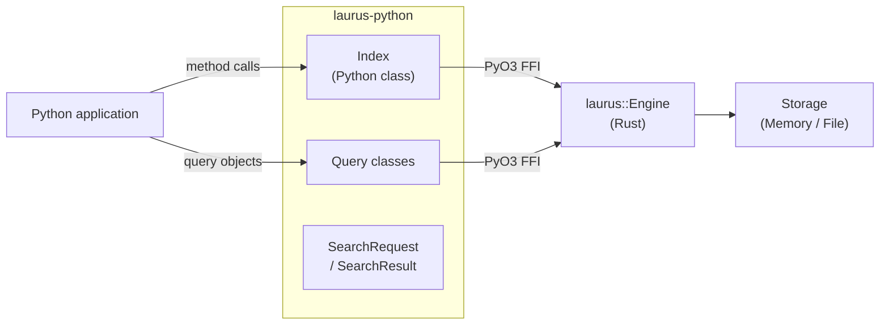

# Python Binding Overview

The `laurus-python` package provides Python bindings for the Laurus search engine. It is built as a native Rust extension using [PyO3](https://github.com/PyO3/pyo3) and [Maturin](https://github.com/PyO3/maturin), giving Python programs direct access to Laurus's lexical, vector, and hybrid search capabilities with near-native performance.

## Features

- **Lexical Search** -- Full-text search powered by an inverted index with BM25 scoring
- **Vector Search** -- Approximate nearest neighbor (ANN) search using Flat, HNSW, or IVF indexes
- **Hybrid Search** -- Combine lexical and vector results with fusion algorithms (RRF, WeightedSum)
- **Rich Query DSL** -- Term, Phrase, Fuzzy, Wildcard, NumericRange, Geo, Boolean, Span queries
- **Text Analysis** -- Tokenizers, filters, stemmers, and synonym expansion
- **Flexible Storage** -- In-memory (ephemeral) or file-based (persistent) indexes
- **Pythonic API** -- Clean, intuitive Python classes with full type information

## Architecture



The Python classes are thin wrappers around the Rust engine.
Each call crosses the PyO3 FFI boundary once; the Rust engine
then executes the operation entirely in native code.

Although the Rust engine uses async I/O internally, all Python
methods are exposed as **synchronous** functions. This is because
Python's GIL (Global Interpreter Lock) would make an async API
cumbersome (it would require `asyncio.run()` everywhere). Instead,
each method calls `tokio::Runtime::block_on()` under the hood to
bridge async Rust to synchronous Python, releasing the GIL for the
duration of that call (`Python::detach`, Issue #1103) so other
Python threads keep running while it's in flight -- a
multi-threaded server genuinely benefits from more worker threads,
rather than every call serializing on the GIL as before.

Because Python threads can now be concurrent writers for the first
time, the engine's existing concurrency caveats become reachable
from Python: `commit()` is not serialized against concurrent
`put`/`add`/`delete` calls, and `CommitPolicy` auto-commit
guarantees hold for single-writer ingestion -- best-effort under
concurrent writers on a shared `Index`. Use explicit `commit()`
calls, or a single ingest thread, when you need those guarantees
under concurrency.

> **Note:** The Node.js binding (`laurus-nodejs`) exposes the
> same Rust engine methods as native `async` / `Promise` APIs,
> since Node.js's event loop supports async natively.

## Quick Start

```python
import laurus

# Create an in-memory index
index = laurus.Index()

# Index documents
index.put_document("doc1", {"title": "Introduction to Rust", "body": "Systems programming language."})
index.put_document("doc2", {"title": "Python for Data Science", "body": "Data analysis with Python."})
index.commit()

# Search
results = index.search("title:rust", limit=5)
for r in results:
    print(f"[{r.id}] score={r.score:.4f}  {r.document['title']}")
```

## Sections

- [Installation](laurus-python/installation.md) -- How to install the package
- [Quick Start](laurus-python/quickstart.md) -- Hands-on introduction with examples
- [API Reference](laurus-python/api_reference.md) -- Complete class and method reference
- [Development](laurus-python/development.md) -- Building from source, testing, and project layout
