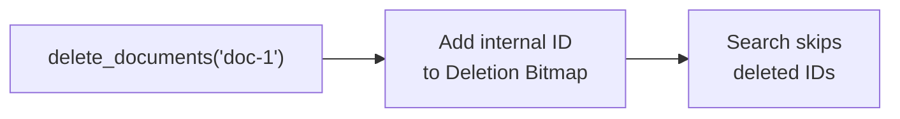
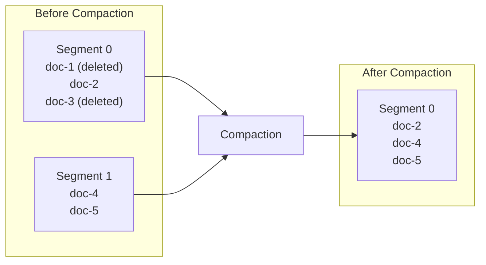

# Deletions & Compaction

Laurus uses a two-phase deletion strategy: fast **logical deletion** followed by periodic **physical compaction**.

## Deleting Documents

```rust
// Delete a document by its external ID
engine.delete_documents("doc-1").await?;
engine.commit().await?;
```

## Logical Deletion

When a document is deleted, it is **not** immediately removed from the index files. Instead:



1. The document's internal ID is added to a **deletion bitmap**
2. The bitmap is checked during every search, filtering out deleted documents from results
3. The original data remains in the segment files

This applies uniformly to the **lexical** and **vector (HNSW)** indexes. For HNSW the
deleted node stays in the graph — its vector is still used to keep the graph connected —
but the [deletion-aware traversal](../concepts/search/vector_search.md) excludes it from
results. A delete therefore never rebuilds the graph; the cost is the same O(1) bitmap
mark regardless of index size. Physical reclamation happens later, during compaction.

### Why Logical Deletion?

| Benefit | Description |
| :--- | :--- |
| **Speed** | O(1) — flipping a bit is instant |
| **Immutable segments** | Segment files are never modified in place, simplifying concurrency |
| **Safe recovery** | If a crash occurs, the deletion bitmap can be reconstructed from the WAL |

## Upserts (Update = Delete + Insert)

When you index a document with an existing external ID, Laurus performs an automatic upsert:

1. The old document is logically deleted (its ID is added to the deletion bitmap)
2. A new document is inserted with a new internal ID
3. The external-to-internal ID mapping is updated

```rust
// First insert
engine.put_document("doc-1", doc_v1).await?;
engine.commit().await?;

// Update: old version is logically deleted, new version is inserted
engine.put_document("doc-1", doc_v2).await?;
engine.commit().await?;
```

## Physical Compaction

Over time, logically deleted documents accumulate and waste space. Compaction reclaims this space by rewriting segment files without the deleted entries.



### What Compaction Does

1. Reads all live (non-deleted) documents from existing segments
2. Rebuilds the inverted index and/or vector index without deleted entries
3. Writes new, clean segment files
4. Removes the old segment files
5. Resets the deletion bitmap

### Cost and Frequency

| Aspect | Detail |
| :--- | :--- |
| **CPU cost** | High — rebuilds index structures from scratch |
| **I/O cost** | High — reads all data, writes new segments |
| **Blocking** | Searches continue during compaction (reads see the old segments until the new ones are ready) |
| **Frequency** | Run when deleted documents exceed a threshold (e.g., 10-20% of total) |

### When to Compact

- **Low-write workloads**: Compact periodically (e.g., daily or weekly)
- **High-write workloads**: Compact when the deletion ratio exceeds a threshold
- **After bulk updates**: Compact after a large batch of upserts

### Automatic Compaction

For the HNSW vector index, compaction can run automatically. When
`DeletionConfig::auto_compaction` is enabled (the default), `commit()` checks
the deletion ratio (deleted nodes / total committed nodes) and triggers
compaction once it reaches `DeletionConfig::compaction_threshold` (default
`0.3`). Compaction resets the ratio to zero, so it does not re-fire until
deletions accumulate again — bounding tombstone growth without a manual
`optimize()`. Set `auto_compaction` to `false` to manage compaction yourself.

## Deletion Bitmap

The deletion bitmap tracks which internal IDs have been deleted:

- **Storage**: a [Roaring bitmap](https://roaringbitmap.org/) of deleted document IDs. For the
  dense deletion sets that accumulate over a segment's life this is dramatically smaller than a
  plain ID list — e.g. a 10M-doc segment at 10% deletion is ~125 KB on disk instead of ~8 MB.
- **Lookup**: a branch-light bit test, which stays CPU-cache-resident even for large deletion
  sets — `is_deleted` is on the per-document (lexical) and per-neighbour (vector) search hot
  paths.

The bitmap is persisted alongside the index segments (the `.delmap` file) and is rebuilt from
the WAL during recovery. The on-disk format is versioned: the current writer emits v4 (Roaring),
and the reader still loads the older v1–v3 (raw ID list) layouts for backward compatibility.

### Group-Committed Persistence

Deletion state is persisted **once per commit**, not once per delete. Each delete (including
the delete-first step of an upsert) only updates the in-memory bitmap; the `.delmap` files and
the segments' `has_deletions` metadata flags are written together when `commit()` runs. This
removes several fsyncs from every existing-ID upsert, which matters for update-heavy ingest.

Durability is unchanged: the WAL records every delete *before* the index mutation, so a crash
before the commit replays the deletions on the next startup — and recovery finishes with an
automatic commit, so the replayed state (including deletions) is immediately searchable on the
reopened engine. Consequently, deletion **visibility is commit-scoped**: like newly added
documents, a deletion becomes visible to searches after the next `commit()` (upsert
deduplication within an uncommitted batch is handled separately and is always correct).

## Next Steps

- How data is persisted: [Persistence & WAL](persistence.md)
- ID management and internal/external ID mapping: [ID Management](id_management.md)
