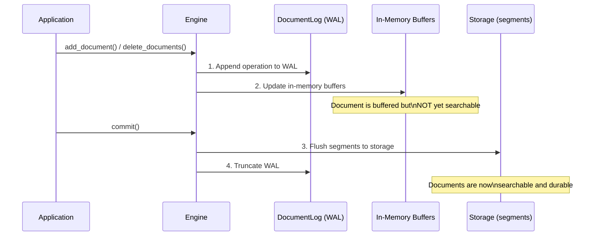
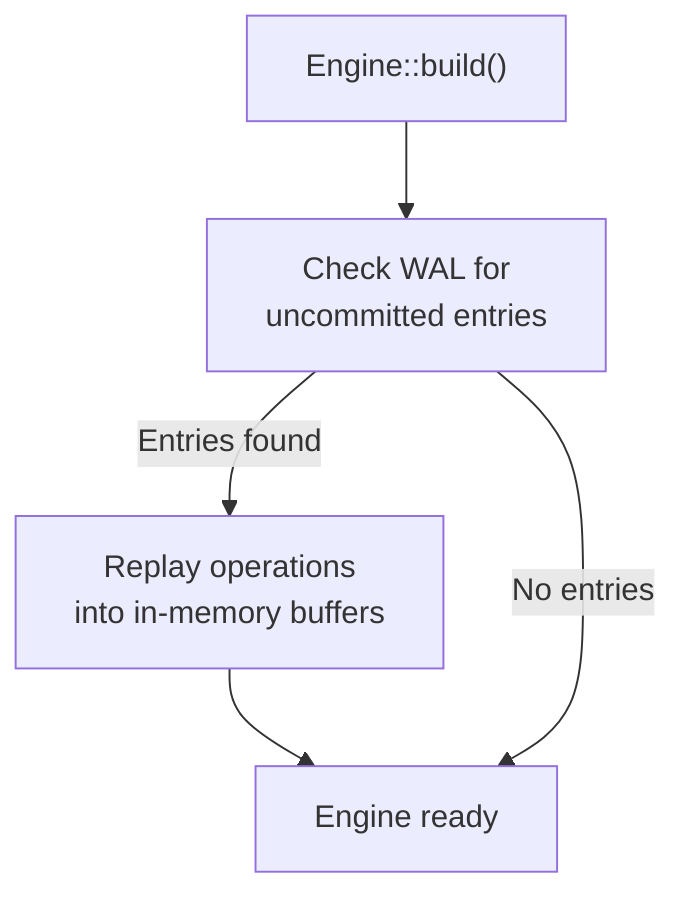

# Persistence & WAL

Laurus uses a **Write-Ahead Log (WAL)** to ensure data durability. Every write operation is persisted to the WAL before modifying in-memory structures, guaranteeing that no data is lost even if the process crashes.

## Write Path



### Key Principles

1. **WAL-first**: Every write (add or delete) is appended to the WAL before updating in-memory structures
2. **Buffered writes**: In-memory buffers accumulate changes until `commit()` is called
3. **Atomic commit**: `commit()` flushes all buffered changes to segment files and truncates the WAL
4. **Crash safety**: If the process crashes between writes and commit, the WAL is replayed on the next startup
5. **Atomic file writes**: Segment files (e.g. the HNSW `.hnsw` graph, its metadata, and the deletion bitmap) are written to a temporary file and atomically renamed into place, so a crash mid-write leaves the previously committed file intact rather than a truncated one
6. **Checksum verification**: Those files carry a CRC-32 (a footer on `.hnsw`, framing on `metadata.json` and the deletion bitmap) that is verified on load, so silent on-disk corruption is detected instead of being read as valid data. Files written before checksums were added still load (the checksum is optional per file)

## Write-Ahead Log (WAL)

The WAL is managed by the `DocumentLog` component and stored at the root level of the storage backend (`engine.wal`).

### WAL Entry Types

| Entry Type | Description |
| :--- | :--- |
| **Upsert** | Document content + external ID + assigned internal ID |
| **Delete** | External ID of the document to remove |

### WAL File

The WAL file (`engine.wal`) is an append-only binary log. Each entry is self-contained with:

- Operation type (add/delete)
- Sequence number
- Payload (document data or ID)

## Recovery

When an engine is built (`Engine::builder(...).build().await`), it automatically checks for remaining WAL entries and replays them (the WAL is truncated on commit, so any remaining entries are from a crashed session):



Recovery is transparent — you do not need to handle it manually.

## The Commit Lifecycle

```rust
// 1. Add documents (buffered, not yet searchable)
engine.add_document("doc-1", doc1).await?;
engine.add_document("doc-2", doc2).await?;

// 2. Commit — flush to persistent storage
engine.commit().await?;
// Documents are now searchable

// 3. Add more documents
engine.add_document("doc-3", doc3).await?;

// 4. If the process crashes here, doc-3 is in the WAL
//    and will be recovered on next startup
```

### When to Commit

| Strategy | Description | Use Case |
| :--- | :--- | :--- |
| **After each document** | Maximum durability, minimum search latency | Real-time search with few writes |
| **After a batch** | Good balance of throughput and latency | Bulk indexing |
| **Periodically** | Maximum write throughput | High-volume ingestion |

> **Tip:** Commits are relatively expensive because they flush segments to storage. For bulk indexing, batch many documents before calling `commit()`.

## Storage Layout

The engine uses `PrefixedStorage` to organize data:

```text
<storage root>/
├── lexical/          # Inverted index segments
│   ├── seg-000/
│   │   ├── terms.dict
│   │   ├── postings.post
│   │   └── ...
│   └── metadata.json
├── vector/           # Vector index segments
│   ├── seg-000/
│   │   ├── graph.hnsw
│   │   ├── vectors.vecs
│   │   └── ...
│   └── metadata.json
├── documents/        # Document storage
│   └── ...
└── engine.wal        # Write-ahead log
```

## Next Steps

- How deletions are handled: [Deletions & Compaction](deletions.md)
- Storage backends: [Storage](../concepts/storage.md)
