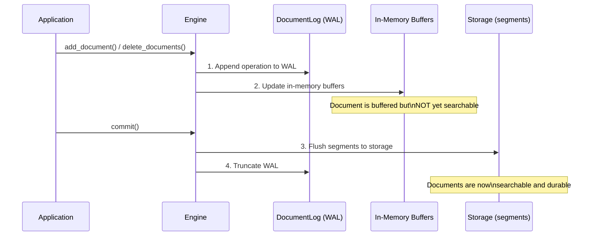
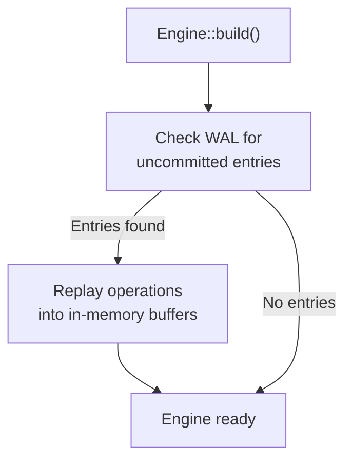

# Persistence & WAL

Laurus uses a **Write-Ahead Log (WAL)** to ensure data durability. Every write operation is persisted to the WAL before modifying in-memory structures, guaranteeing that no data is lost even if the process crashes.

## Write Path



### Key Principles

1. **WAL-first**: Every write (add or delete) is appended to the WAL before updating in-memory structures
2. **Buffered writes**: In-memory buffers accumulate changes until `commit()` is called
3. **Atomic commit**: `commit()` flushes all buffered changes to segment files and truncates the WAL
4. **Crash safety**: If the process crashes between writes and commit, the WAL is replayed on the next startup
5. **Atomic file writes**: Segment files (e.g. the HNSW `.hnsw` graph, its metadata, and the deletion bitmap) are written to a temporary file and atomically renamed into place, so a crash mid-write leaves the previously committed file intact rather than a truncated one
6. **Checksum verification**: Those files carry a CRC-32 (a footer on `.hnsw` and the `.hnsw.f32` rerank sidecar, framing on `metadata.json` and the deletion bitmap) that is verified on load, so silent on-disk corruption is detected instead of being read as valid data. Files written before checksums were added still load (the checksum is optional per file). Loaders also bound buffer allocations against the real file size before trusting a header, so a corrupt size field is rejected as corruption rather than triggering a huge out-of-memory allocation
7. **Versioned segment headers**: Vector segments carry a format version in their shared header. HNSW segments are written with version 2, whose graph block stores segment-local 32-bit ordinals instead of 64-bit document ids (roughly halving the graph block on disk); version 1 segments written by older builds still load and are upgraded to version 2 on the next rewrite (compaction or merge). Flat and IVF segments keep writing version 1, so older builds can still read them

## Write-Ahead Log (WAL)

The WAL is managed by the `DocumentLog` component and stored at the root level of the storage backend (`engine.wal`).

### WAL Entry Types

| Entry Type | Description |
| :--- | :--- |
| **Upsert** | Document content + external ID + assigned internal ID |
| **Delete** | External ID of the document to remove |

### WAL File

The WAL file (`engine.wal`) is an append-only binary log. Each entry is self-contained with:

- Operation type (add/delete)
- Sequence number
- Payload (document data or ID)

### On-disk framing

The file begins with a 5-byte header (`b"LWAL"` magic + a version byte) followed by length-prefixed records. There are three framings, and a file keeps a single framing for its whole life (an older file is rewritten to the current format only on the next commit/truncate — formats are never mixed within one file):

| Version | Framing | Payload |
| :--- | :--- | :--- |
| **v3** (current) | `[u32 len][u32 crc32][payload]` | compact **rkyv binary** record |
| **v2** | `[u32 len][u32 crc32][payload]` | JSON record (read-only, back-compat) |
| **legacy** (pre-CRC) | `[u32 len][payload]` | JSON record, no checksum (read-only) |

The CRC-32 (v2/v3) is computed over `len || payload`, detecting both a corrupted length and a corrupted body. The reader recovers all three formats, so a WAL written by an older build still replays after an upgrade.

Since v3, each payload is a compact rkyv binary record rather than JSON. Vectors store as raw `f32` (4 bytes each) instead of decimal strings, so for vector-heavy documents the WAL is roughly 2-3x smaller and replays correspondingly faster — without changing durability (the CRC framing and recovery semantics are unchanged).

## Recovery

When an engine is built (`Engine::builder(...).build().await`), it automatically checks for remaining WAL entries and replays them (the WAL is truncated on commit, so any remaining entries are from a crashed session):



Recovery is transparent — you do not need to handle it manually.

## The Commit Lifecycle

```rust
// 1. Add documents (buffered, not yet searchable)
engine.add_document("doc-1", doc1).await?;
engine.add_document("doc-2", doc2).await?;

// 2. Commit — flush to persistent storage
engine.commit().await?;
// Documents are now searchable

// 3. Add more documents
engine.add_document("doc-3", doc3).await?;

// 4. If the process crashes here, doc-3 is in the WAL
//    and will be recovered on next startup
```

### When to Commit

| Strategy | Description | Use Case |
| :--- | :--- | :--- |
| **After each document** | Maximum durability, minimum search latency | Real-time search with few writes |
| **After a batch** | Good balance of throughput and latency | Bulk indexing |
| **Periodically** | Maximum write throughput | High-volume ingestion |

> **Tip:** Commits are relatively expensive because they flush segments to storage. For bulk indexing, batch many documents before calling `commit()`.

## WAL Durability Policy

By default, each `add`/`delete` fsyncs the WAL before returning, so a successful write can never be lost to a crash. When ingesting at high volume, that per-write fsync becomes the throughput bottleneck. The `WalSyncPolicy` lets you trade per-write durability for throughput:

| Policy | Durability | Throughput | Analogue |
| :--- | :--- | :--- | :--- |
| `PerRecord` (default) | Every successful write is durable | Bounded by one fsync per write | SQLite `synchronous = FULL` |
| `Group { max_records, max_bytes }` | A crash may lose up to the last unsynced batch | fsync amortized over a batch | SQLite `synchronous = NORMAL` |

Under `Group`, the fsync is deferred and issued once **either** `max_records` records **or** `max_bytes` bytes have accumulated since the last sync (whichever comes first). Configure it on the builder:

```rust
use laurus::WalSyncPolicy;
use std::time::Duration;

let engine = Engine::builder(storage, schema)
    // Group commit with the default thresholds (1024 records / 1 MiB), no timer.
    .wal_sync_policy(WalSyncPolicy::group_with_defaults())
    // ...the default thresholds plus a periodic flush every 500 ms:
    // .wal_sync_policy(WalSyncPolicy::group_with_interval(Duration::from_millis(500)))
    // ...or choose your own batch size and timer:
    // .wal_sync_policy(WalSyncPolicy::Group {
    //     max_records: 4096,
    //     max_bytes: 4 * 1024 * 1024,
    //     max_interval: Some(Duration::from_secs(1)),
    // })
    .build()
    .await?;
```

### Periodic Flush Timer

`Group.max_interval` adds a time bound to the size-based thresholds. When set, the engine runs a background timer that forces the WAL durable at least that often, so a trailing partial batch under a **low ingest rate** — where the record/byte thresholds may never be reached — is not left unsynced indefinitely. The flush is a no-op when nothing is pending, so an idle timer costs nothing. `None` disables the timer.

> **WASM note:** the timer is honored on native targets only. On `wasm32` there are no background threads, so `max_interval` is ignored; durability there relies on the record/byte thresholds, `commit()`, and `flush_wal()`.

### Durability Guarantees

- **`commit()` is a hard barrier under both policies.** It forces the WAL durable before materializing any store, so the WAL is never less durable than the committed indexes. After a successful `commit()`, all data is durable regardless of policy.
- **`flush_wal()` forces a flush on demand** without a full commit — the way to bound the crash-loss window under `Group` at an application-chosen point, analogous to a SQLite WAL checkpoint:

  ```rust
  engine.add_document("doc-1", doc1).await?;
  engine.flush_wal()?; // the WAL is now durable, without committing segments
  ```

- **A torn trailing record is never resurrected.** Each record is CRC-32 framed; on recovery a record that fails its checksum (or is truncated) is dropped along with everything after it, so the recovered log is always a gap-free valid prefix — group commit only ever risks losing a *suffix* of recent writes, never corrupting earlier ones.

> **Note:** `Group` is opt-in; the default `PerRecord` policy is unchanged, so existing code keeps its per-write durability with no changes.

## Commit Durability Ladder & Crash Safety

`commit()` persists state in a fixed order, and the order is what makes a crash
at any point recoverable. Each lexical/vector store tracks its own `last_wal_seq`
checkpoint — the sequence number of the last WAL record it has materialized — so
recovery can skip already-applied records. The persisted `last_wal_seq` lives in
the store's on-disk metadata and is written **only** during the store's commit.

The commit ladder is:

1. **`flush_wal()`** — force the WAL durable (the hard barrier). Under `Group`
   this fsyncs any deferred batch; under `PerRecord` it is a no-op.
2. **`lexical.commit()`** — write the lexical segment and metadata (including
   `last_wal_seq`), then `sync()`.
3. **`vector.commit()`** — write the vector segment, then `sync()`.
4. **`commit_documents()`** — write the document store segment, then `sync()`.
5. **`truncate()`** — replace the WAL with a fresh, empty, fsync'd file.

This order guarantees two invariants:

- **The WAL is never less durable than any persisted index.** `last_wal_seq` is
  only persisted in step 2+, which always runs *after* the step-1 barrier, so a
  committed index can never reference a WAL record that is not yet durable.
- **Every store is fully durable before the WAL is truncated.** Steps 2–4 each
  `sync()` before step 5 empties the WAL, so the WAL is only discarded once the
  data it described is safely materialized.

Recovery replays the WAL on the next `build()`, skipping records at or below each
store's `last_wal_seq`. Replay is **idempotent** — it re-applies each record
under its originally recorded `doc_id`, so re-running it overwrites rather than
duplicates. Because each store keeps its own checkpoint, a commit that fails
partway leaves the stores at different `last_wal_seq` values and recovery simply
re-applies what each store is missing. (The vector store currently keeps its
checkpoint at `0`, so it replays the full retained WAL on every recovery —
correct and idempotent, just not yet optimized.)

The table below shows the outcome of a crash at each step (identical for
`PerRecord` and `Group`, because the step-1 barrier has already run):

| Crash point | Durable on disk | Recovery outcome |
| --- | --- | --- |
| After step 1, before step 2 | WAL only | Replay all pending records into both stores |
| After step 2, before step 3 | WAL + lexical (`last_wal_seq = N`) | Lexical skips ≤ N; vector replays from WAL |
| After step 3, before step 4 | WAL + lexical + vector | Both stores skip; documents restored from WAL |
| After step 4, before step 5 | WAL + all stores | WAL still present; both stores skip, no duplicates |
| After step 5 | All stores, WAL empty | Nothing to replay |

No interleaving lets a committed index reference a lost WAL record, so group
commit introduces no new durability gap beyond its documented contract (a crash
can lose a *suffix* of writes not yet made durable by `flush_wal()` or `commit()`).

## Storage Layout

The engine uses `PrefixedStorage` to organize data:

```text
<storage root>/
├── lexical/          # Inverted index segments
│   ├── seg-000/
│   │   ├── terms.dict
│   │   ├── postings.post
│   │   └── ...
│   └── metadata.json
├── vector/           # Vector index segments
│   ├── seg-000/
│   │   ├── graph.hnsw
│   │   ├── vectors.vecs
│   │   └── ...
│   └── metadata.json
├── documents/        # Document storage
│   └── ...
└── engine.wal        # Write-ahead log
```

## Next Steps

- How deletions are handled: [Deletions & Compaction](deletions.md)
- Storage backends: [Storage](../concepts/storage.md)
