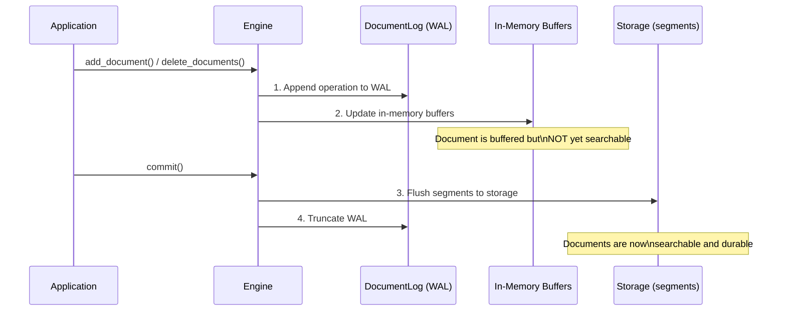
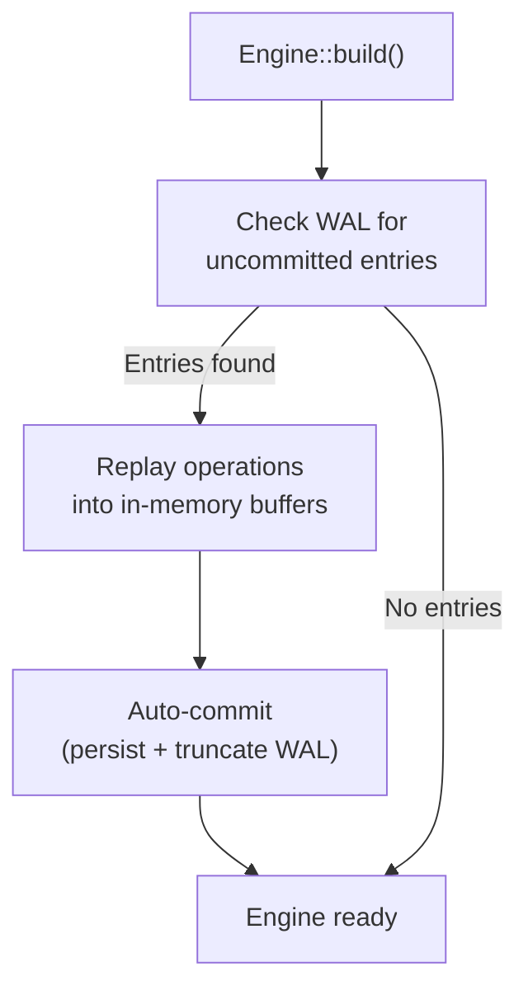

# Persistence & WAL

Laurus uses a **Write-Ahead Log (WAL)** to ensure data durability. Every write operation is persisted to the WAL before modifying in-memory structures, guaranteeing that no data is lost even if the process crashes.

## Write Path



### Key Principles

1. **WAL-first**: Every write (add or delete) is appended to the WAL before updating in-memory structures
2. **Buffered writes**: In-memory buffers accumulate changes until `commit()` is called
3. **Atomic commit**: `commit()` flushes all buffered changes to segment files and truncates the WAL
4. **Commit-scoped visibility**: a lexical segment is written as soon as the writer's buffer fills, which can happen long before `commit()`, so the segment files existing on storage is not what makes its documents searchable. Publication is a manifest entry that only `commit()` adds, and segment discovery reads only the manifest — so "documents become searchable only after `commit()`" holds regardless of when a searcher happens to be built. Deletions are published in the same step, after their bitmaps are durable, so a reader that can see a segment can always filter it
5. **Crash safety**: If the process crashes between writes and commit, the WAL is replayed on the next startup
6. **Atomic file writes**: Segment files (e.g. the HNSW `.hnsw` graph, its metadata, and the deletion bitmap) are written to a temporary file and atomically renamed into place, so a crash mid-write leaves the previously committed file intact rather than a truncated one
7. **Checksum verification**: Those files carry a CRC-32 (a footer on `.hnsw` and the `.hnsw.f32` rerank sidecar, framing on `metadata.json` and the deletion bitmap) that is verified on load, so silent on-disk corruption is detected instead of being read as valid data. Files written before checksums were added still load (the checksum is optional per file). Loaders also bound buffer allocations against the real file size before trusting a header, so a corrupt size field is rejected as corruption rather than triggering a huge out-of-memory allocation
8. **Versioned segment headers**: Vector segments carry a format version in their shared header, forming a feature ladder. Version 2 (HNSW only) stores the graph block as segment-local 32-bit ordinals instead of 64-bit document ids (roughly halving the graph block on disk). Version 3 (all vector index types) adds a per-segment field-name dictionary: records reference field names by a 16-bit id instead of repeating the full name inline, shrinking every record by the name's length plus two bytes. New segments are written at version 3; segments written by older builds (versions 1 and 2) still load and are upgraded on the next rewrite (compaction or merge)

## Write-Ahead Log (WAL)

The WAL is managed by the `DocumentLog` component and stored at the root level of the storage backend (`engine.wal`).

### WAL Entry Types

| Entry Type | Description |
| :--- | :--- |
| **Upsert** | Document content + external ID + assigned internal ID |
| **Delete** | External ID of the document to remove |

### WAL File

The WAL file (`engine.wal`) is an append-only binary log. Each entry is self-contained with:

- Operation type (add/delete)
- Sequence number
- Payload (document data or ID)

### On-disk framing

The file begins with a 5-byte header (`b"LWAL"` magic + a version byte) followed by length-prefixed records. There are three framings, and a file keeps a single framing for its whole life (an older file is rewritten to the current format only on the next commit/truncate — formats are never mixed within one file):

| Version | Framing | Payload |
| :--- | :--- | :--- |
| **v3** (current) | `[u32 len][u32 crc32][payload]` | compact **rkyv binary** record |
| **v2** | `[u32 len][u32 crc32][payload]` | JSON record (read-only, back-compat) |
| **legacy** (pre-CRC) | `[u32 len][payload]` | JSON record, no checksum (read-only) |

The CRC-32 (v2/v3) is computed over `len || payload`, detecting both a corrupted length and a corrupted body. The reader recovers all three formats, so a WAL written by an older build still replays after an upgrade.

Since v3, each payload is a compact rkyv binary record rather than JSON. Vectors store as raw `f32` (4 bytes each) instead of decimal strings, so for vector-heavy documents the WAL is roughly 2-3x smaller and replays correspondingly faster — without changing durability (the CRC framing and recovery semantics are unchanged).

## Recovery

When an engine is built (`Engine::builder(...).build().await`), it automatically checks for remaining WAL entries and replays them (the WAL is truncated on commit, so any remaining entries are from a crashed session). Recovery finishes with an **automatic commit**: the replayed state — including deletions, whose persistence is [group-committed](deletions.md#group-committed-persistence) — is persisted and immediately searchable, and the WAL is truncated, so a subsequent crash has nothing to re-replay:



Recovery is transparent — you do not need to handle it manually. Note that a post-crash open therefore does commit-scale work (segment flush, index writes), and `Engine::build` returns an error if that commit fails (e.g. the disk is full); reopening after the condition clears is safe, since replay is idempotent and the WAL is only truncated after the commit succeeds.

## The Commit Lifecycle

```rust
// 1. Add documents (buffered, not yet searchable)
engine.add_document("doc-1", doc1).await?;
engine.add_document("doc-2", doc2).await?;

// 2. Commit — flush to persistent storage
engine.commit().await?;
// Documents are now searchable

// 3. Add more documents
engine.add_document("doc-3", doc3).await?;

// 4. If the process crashes here, doc-3 is in the WAL
//    and will be recovered on next startup
```

### When to Commit

| Strategy | Description | Use Case |
| :--- | :--- | :--- |
| **After each document** | Maximum durability, minimum search latency | Real-time search with few writes |
| **After a batch** | Good balance of throughput and latency | Bulk indexing |
| **Periodically** | Maximum write throughput | High-volume ingestion |

> **Tip:** Commits are relatively expensive because they flush segments to storage. For bulk indexing, batch many documents before calling `commit()`.

### Auto-commit Policy

Instead of calling `commit()` yourself, you can let the engine run the commit ladder automatically at an ingestion-driven cadence via `CommitPolicy`, configured on the builder:

```rust
use laurus::CommitPolicy;

let engine = Engine::builder(storage, schema)
    // Commit automatically after every 1,000 applied documents.
    .commit_policy(CommitPolicy::EveryDocs(1000))
    .build()
    .await?;

// No explicit commit() needed — every 1,000th document triggers one.
engine.put_documents(one_thousand_docs).await?;
```

| Policy | Behavior |
| :--- | :--- |
| `Manual` (default) | Never auto-commits; you drive every `commit()`. Identical to the historical behavior. |
| `EveryDocs(n)` | Runs the commit ladder after every `n` applied documents, across the singular and batch APIs. `EveryDocs(0)` disables auto-commit (same as `Manual`). |
| `Interval(Duration)` | Runs the commit ladder at least every `Duration` via a background timer, so a trailing partial batch is committed even while ingestion is idle. **Native targets only** — a no-op on `wasm32` (no background threads), like `WalSyncPolicy::Group`'s `max_interval`. |

Key semantics:

- **Group-commit preserved.** Each auto-commit is one WAL flush plus one materialization ladder — never one commit per document. Within a single `put_documents` / `add_documents` call the auto-commit fires **every `n` documents** (chunked), so a large batch materializes incrementally rather than in one final ladder; the trailing `< n` remainder stays WAL-durable until the next boundary or an explicit `commit()`.
- **Orthogonal to `WalSyncPolicy`.** `CommitPolicy` decides *when the stores materialize*; `WalSyncPolicy` decides *WAL fsync durability*. Auto-commit works under any WAL policy because `commit()` always begins with a WAL flush.
- **Crash semantics unchanged.** An auto-commit is a normal commit; a crash replays the uncommitted tail exactly as it would under manual commits.
- **Concurrency.** The exact cadence and the usual "acknowledged write is durable" guarantee hold for **single-writer ingestion** (the model the engine's write path — and the CLI/bindings — are built around). Under concurrent writers on a shared engine, auto-commit is best-effort: because the commit ladder is not atomic with respect to another thread's in-flight write, a write acknowledged while a concurrent auto-commit runs may only become durable at the following commit, and the cadence may drift. (A concurrent manual `commit()` races the same way — auto-commit merely triggers it from the ingest path.) The `Interval` timer runs the ladder on its own thread, so the same best-effort caveat applies to it. Use explicit commits, or a single ingest task, if you need these guarantees under concurrency.

## Batch Ingestion

`put_documents` / `add_documents` are the batched forms of `put_document` / `add_document`. They apply their `(id, doc)` pairs **sequentially, in input order**, and under the default `PerRecord` policy they make the whole batch durable with a **single WAL fsync at batch end** instead of one per record:

```rust
let docs: Vec<(String, Document)> = build_batch();
engine.put_documents(docs).await?; // one fsync, all docs as durable as singular puts
engine.commit().await?;            // one segment flush for the whole batch
```

Semantics to be aware of:

- **Ordering**: duplicate external IDs within one `put_documents` batch dedup exactly like the same puts issued sequentially — the last occurrence wins. Repeating an ID in `add_documents` legitimately appends multiple chunks.
- **Fail-fast, no rollback**: the batch stops at the first document that cannot be applied and returns `LaurusError::BatchIngest { failed_index, failed_id, applied, .. }`. The `applied` documents before the failure are **not** rolled back — they stay in the WAL and NRT buffers (resolvable by `_id` immediately, searchable after the next `commit()`, durable at that commit, replayed on crash recovery), and the batch-end WAL flush runs on the error path too. Retrying the batch, or its suffix starting at `failed_index`, is idempotent under put semantics.
- **Durability**: when the call returns `Ok`, every document in the batch is exactly as durable as a successful singular put. A crash mid-call loses at most the un-fsync'd tail; recovery replays the fsync'd prefix per document, and a torn trailing record is dropped by the CRC framing as usual.
- **Sizing**: the engine clones each document into the WAL as it goes, so batch memory is dominated by the caller's `Vec`. Batches of 1,000-10,000 documents per call are a good default; chunk larger corpora into multiple calls (and commit periodically to bound segment sizes).
- **Under `Group` policy**: the group thresholds keep firing mid-batch, so that policy's bounded loss window is preserved; the batch-end flush still runs.
- **Concurrent singular writes**: a `put_document` / `add_document` / `delete_documents` call that completes while another task's batch is in flight keeps its full per-record durability — singular writes re-assert the fsync before acknowledging, so a batch never weakens anyone else's guarantee.

## WAL Durability Policy

By default, each `add`/`delete` fsyncs the WAL before returning, so a successful write can never be lost to a crash. When ingesting at high volume, that per-write fsync becomes the throughput bottleneck. The `WalSyncPolicy` lets you trade per-write durability for throughput:

| Policy | Durability | Throughput | Analogue |
| :--- | :--- | :--- | :--- |
| `PerRecord` (default) | Every successful write is durable | Bounded by one fsync per write | SQLite `synchronous = FULL` |
| `Group { max_records, max_bytes }` | A crash may lose up to the last unsynced batch | fsync amortized over a batch | SQLite `synchronous = NORMAL` |

Under `Group`, the fsync is deferred and issued once **either** `max_records` records **or** `max_bytes` bytes have accumulated since the last sync (whichever comes first). Configure it on the builder:

```rust
use laurus::WalSyncPolicy;
use std::time::Duration;

let engine = Engine::builder(storage, schema)
    // Group commit with the default thresholds (1024 records / 1 MiB), no timer.
    .wal_sync_policy(WalSyncPolicy::group_with_defaults())
    // ...the default thresholds plus a periodic flush every 500 ms:
    // .wal_sync_policy(WalSyncPolicy::group_with_interval(Duration::from_millis(500)))
    // ...or choose your own batch size and timer:
    // .wal_sync_policy(WalSyncPolicy::Group {
    //     max_records: 4096,
    //     max_bytes: 4 * 1024 * 1024,
    //     max_interval: Some(Duration::from_secs(1)),
    // })
    .build()
    .await?;
```

### Periodic Flush Timer

`Group.max_interval` adds a time bound to the size-based thresholds. When set, the engine runs a background timer that forces the WAL durable at least that often, so a trailing partial batch under a **low ingest rate** — where the record/byte thresholds may never be reached — is not left unsynced indefinitely. The flush is a no-op when nothing is pending, so an idle timer costs nothing. `None` disables the timer.

> **WASM note:** the timer is honored on native targets only. On `wasm32` there are no background threads, so `max_interval` is ignored; durability there relies on the record/byte thresholds, `commit()`, and `flush_wal()`.

### Durability Guarantees

- **`commit()` is a hard barrier under both policies.** It forces the WAL durable before materializing any store, so the WAL is never less durable than the committed indexes. After a successful `commit()`, all data is durable regardless of policy.
- **`flush_wal()` forces a flush on demand** without a full commit — the way to bound the crash-loss window under `Group` at an application-chosen point, analogous to a SQLite WAL checkpoint:

  ```rust
  engine.add_document("doc-1", doc1).await?;
  engine.flush_wal()?; // the WAL is now durable, without committing segments
  ```

- **A torn trailing record is never resurrected.** Each record is CRC-32 framed; on recovery a record that fails its checksum (or is truncated) is dropped along with everything after it, so the recovered log is always a gap-free valid prefix — group commit only ever risks losing a *suffix* of recent writes, never corrupting earlier ones.

> **Note:** `Group` is opt-in; the default `PerRecord` policy is unchanged, so existing code keeps its per-write durability with no changes.

## Commit Durability Ladder & Crash Safety

`commit()` persists state in a fixed order, and the order is what makes a crash
at any point recoverable. Each lexical/vector store tracks its own `last_wal_seq`
checkpoint — the sequence number of the last WAL record it has materialized — so
recovery can skip already-applied records. The persisted `last_wal_seq` lives in
the store's on-disk metadata and is written **only** during the store's commit.

The lexical control file (`metadata.json`) has a **single authority**: the
in-memory copy owned by the index. The writer the store commits through holds a
shared handle to it, applies its per-commit deltas (documents added, documents
deleted, the WAL checkpoint) under that lock, and persists a snapshot — so no
code path can overwrite the file from a stale copy, and internal writers (such
as the merge engine's segment-replay writer) have no handle and cannot touch
the file at all. A pass with nothing to record skips the persist, and a failed
persist rolls the in-memory copy back to the persisted state with the deltas
retained — the retry re-applies them exactly once, mirroring the manifest's
failure contract below.

Lexical segment **discovery** follows the same authority model through
`segments.json`, an atomically replaced, checksummed manifest of the committed
segment set. Publication is all-or-nothing: a commit adds every flushed
segment in one manifest write, and a merge drops its sources and inserts the
merged segment in one write. The in-memory copy mirrors the last
*successfully persisted* manifest (a failed save leaves the pending state for
the retry), so reader construction is a pure in-memory read — no directory
listing, no per-segment metadata parse. There are no per-segment `.meta`
files any more: the manifest is the only record, files it does not list are
reclaimed at the next open, and an index written before the manifest existed
is migrated by a one-time read of its legacy `.meta` files when opened.

Segment data itself is written as one **compound container** per segment
(`segment_<N>.cfs` — postings, term dictionary, stored documents, field
lengths and statistics, doc values and per-field BKD trees, concatenated
with a trailing part table): one file create and one fsync per flush instead
of one per part. The deletion bitmap (`.delmap`) stays a separate file, as
the only per-segment data rewritten after sealing. Readers detect the layout
per segment, so indexes with older loose-file segments keep working
unchanged, and merges rewrite them into containers over time.
`LAURUS_NO_COMPOUND=1` restores the loose layout as a transitional escape
hatch.
Opening an index whose `segments.json` is missing while segment files are
present is refused loudly rather than served as silently empty. Three
consequences worth knowing: at most **one writing store instance per
directory** is supported (concurrent instances would overwrite each other's
manifest); a standalone `InvertedIndexWriter` is an ephemeral tool — its
commits register segments nowhere, and such files in a manifest-owned
directory are reclaimed; and a pre-manifest binary opening a post-manifest
index finds no `.meta` files and sees it as empty — a one-way format step
worth a release note.

The commit ladder is:

1. **`flush_wal()`** — force the WAL durable (the hard barrier). Under `Group`
   this fsyncs any deferred batch; under `PerRecord` it is a no-op.
2. **`lexical.commit()`** — write the lexical segment and metadata (including
   `last_wal_seq`), then `sync()`.
3. **`vector.commit()`** — write the vector segment, then `sync()`.
4. **`commit_documents()`** — write the document store segment, then `sync()`.
5. **`truncate_retaining_after(applied_before)`** — discard every WAL record
   this commit covered; **retain** any record whose mutation had not finished
   applying to both stores when the commit started (Issue #876).

This order guarantees two invariants:

- **The WAL is never less durable than any persisted index.** `last_wal_seq` is
  only persisted in step 2+, which always runs *after* the step-1 barrier, so a
  committed index can never reference a WAL record that is not yet durable.
- **Every store is fully durable before the WAL is truncated.** Steps 2–4 each
  `sync()` before step 5 discards the covered portion of the WAL, so nothing is
  discarded before the data it described is safely materialized.

`commit()` is **not** serialized against concurrent `put`/`add`/`delete` calls
(nor against `CommitPolicy::Interval`'s background timer, which runs this same
ladder). Step 5 accounts for this: it snapshots the engine's ingest high-water
mark *before* step 1 runs, and retains every WAL record past that snapshot
instead of unconditionally emptying the file. A mutation racing the commit
therefore keeps its WAL record — and is replayed on the next recovery — even
though it was not included in this commit's materialization. When nothing
races the commit (the common case), the snapshot covers the whole WAL and step
5 empties the file exactly as before.

Recovery replays the WAL on the next `build()`, skipping records at or below each
store's `last_wal_seq`. Replay is **idempotent** — it re-applies each record
under its originally recorded `doc_id`, so re-running it overwrites rather than
duplicates. Because each store keeps its own checkpoint, a commit that fails
partway leaves the stores at different `last_wal_seq` values and recovery simply
re-applies what each store is missing. (The vector store currently keeps its
checkpoint at `0`, so it replays the full retained WAL on every recovery —
correct and idempotent, just not yet optimized.)

The table below shows the outcome of a crash at each step (identical for
`PerRecord` and `Group`, because the step-1 barrier has already run):

| Crash point | Durable on disk | Recovery outcome |
| --- | --- | --- |
| After step 1, before step 2 | WAL only | Replay all pending records into both stores |
| After step 2, before step 3 | WAL + lexical (`last_wal_seq = N`) | Lexical skips ≤ N; vector replays from WAL |
| After step 3, before step 4 | WAL + lexical + vector | Both stores skip; documents restored from WAL |
| After step 4, before step 5 | WAL + all stores | WAL still present; both stores skip, no duplicates |
| After step 5 | All stores; WAL empty unless a mutation raced this commit | Nothing to replay (or just the racing mutation's record) |

No interleaving lets a committed index reference a lost WAL record, so group
commit introduces no new durability gap beyond its documented contract (a crash
can lose a *suffix* of writes not yet made durable by `flush_wal()` or `commit()`).

## Storage Layout

The engine uses `PrefixedStorage` to organize data:

```text
<storage root>/
├── lexical/          # Inverted index segments
│   ├── seg-000/
│   │   ├── terms.dict
│   │   ├── postings.post
│   │   └── ...
│   └── metadata.json
├── vector/           # Vector index segments
│   ├── seg-000/
│   │   ├── graph.hnsw
│   │   ├── vectors.vecs
│   │   └── ...
│   └── metadata.json
├── documents/        # Document storage
│   └── ...
└── engine.wal        # Write-ahead log
```

`<storage root>` is a layout-agnostic abstraction: the engine itself has no
concept of `schema.toml` or where its storage root sits within a larger
directory. `laurus-cli`, `laurus-server`, and the language bindings
(Python, Node.js, Ruby, PHP) all place `<storage root>` at
`<index_dir>/store/`, alongside a `<index_dir>/schema.toml` holding the
schema — a convention owned by those entry points, not the engine. This
means an index directory created by one of them can be opened by any of
the others without restructuring anything on disk; see each binding's
`Index`/`create index` documentation for the exact create-vs-reopen
semantics (in particular, reopening an existing index only needs the
directory path — the persisted schema is loaded automatically).

## Next Steps

- How deletions are handled: [Deletions & Compaction](deletions.md)
- Storage backends: [Storage](../concepts/storage.md)
